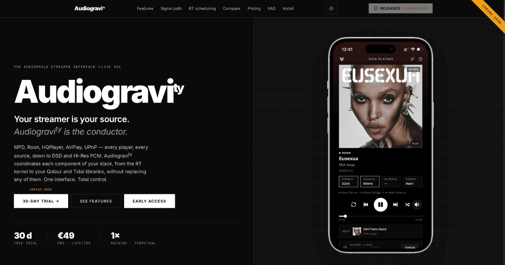

<p align="center">
  
</p>

<p align="center">
  <strong>Your streamer is your source. Audiogravity is the conductor.</strong>
  <br/>
  A native iOS / Android app (PWA) to pilot every audio engine your streamer runs —<br/>
  MPD, Roon Bridge, HQPlayer NAA, AirPlay, UPnP — all the way down to the RT kernel.
  <br/><br/>
  <a href="https://audiogravity.app"><strong>audiogravity.app →</strong></a>
</p>

<p align="center">
  
  
  
  
  
</p>

---

## Features

<table>
  <tr>
    <td width="50%">

**Audio Control**
- Unified transport across MPD, Roon, HQPlayer NAA, AirPlay and UPnP
- UPnP renderer mode via upmpdcli — control AG from BubbleUPnP, Kazoo or any OpenHome control point
- Fullscreen Now Playing — cover art, seekable progress bar, transport controls, album tracklist, multi-source swipe, dynamic background
- HQPlayer DSP remote — filter, shaper, output mode, volume with auto-discovery
- Output steering — USB, Toslink, HDMI
- One-tap profile scenarios (switch entire audio chains instantly)
- Bit-perfect lock with DSD volume protection
- Sleep timer

</td>
    <td width="50%">

**Library & Radio**
- High-resolution browsing — Roon, MPD, MinimServer, Qobuz, Tidal
- Qobuz Hi-Res streaming up to 24-bit / 192 kHz — favourites, new releases, editorial playlists
- Tidal HiFi streaming — lossless FLAC, Favorites, New Releases, Charts, Editorial playlists, in-track seek
- Internet radio — Radio Browser, custom stations, favourites
- UPnP server auto-discovery & browsing

</td>
  </tr>
  <tr>
    <td>

**System & Performance**
- Live signal-path visualisation of your entire Hi-Fi chain
- Config editor — diff preview, backups, conditional restart
- RT scheduling, CPU pinning, per-core governor control — via systemd drop-ins
- µs-scale latency benchmarks from the browser
- Service monitoring with 60s sparklines
- Audio device inventory (ALSA cards, USB DACs)
- Audio software manager — install, update, configure
- Admin terminal — interactive shell in the browser

</td>
    <td>

**Security & Access**
- WebAuthn / passkeys login
- Multi-user with role-based access (admin, user, guest)
- Push notifications (iOS, Android, desktop)
- PWA-installable on iOS and Android
- No cloud account — fully self-hosted

</td>
  </tr>
</table>

> **Note:** Qobuz and Tidal streaming require an active subscription to their respective services — [Qobuz Studio or Sublime](https://www.qobuz.com) · [Tidal HiFi](https://tidal.com). Audiogravity does not provide access to these services.

## Editions

| Edition | Price | What it unlocks |
|---------|-------|-----------------|
| **Trial** | Free · 30 days | Full access to every Pro feature |
| **Starter** | Free · forever | Profiles, Services, Audio Software, System, Users |
| **Pro** | €49 lifetime · 1 machine | Pipeline, Player, Library, Config, Performance |

Pro is a lifetime license — no subscription, no renewal. See [EDITIONS.md](EDITIONS.md) and [EULA.md](EULA.md).

Audiogravity uses a dual-license model:
- **Interface ([audiogravity.ui](https://github.com/audiogravity/audiogravity.ui))** — [MIT](https://github.com/audiogravity/audiogravity.ui/blob/main/LICENSE). Open source — fork it, contribute, or build on it.
- **Core engine ([audiogravity.core](https://github.com/audiogravity/audiogravity.core))** — Proprietary. Distributed as a compiled binary under the [EULA](EULA.md).

Audiogravity also incorporates open-source components. See [THIRD_PARTY_NOTICES.md](THIRD_PARTY_NOTICES.md) for the full list of third-party libraries and their license terms.

## Quick install

```bash
# All-in-one (core + ui)
curl -fsSL https://audiogravity.app/install.sh | sudo bash -s -- --token ghp_xxx

# Or separately
curl -fsSL https://audiogravity.app/install-core.sh | sudo bash -s -- --token ghp_xxx
curl -fsSL https://audiogravity.app/install-ui.sh | sudo bash -s -- --token ghp_xxx
```

> The token is shared during **early access** with approved testers. [Request access →](mailto:contact@audiogravity.app?subject=Audiogravity%20-%20Early%20access%20request)

### Options

The core installer accepts two optional flags:

- **`--vapid-email`** — contact address for Web Push (the VAPID `sub`). If
  omitted, a generic placeholder is used and the installer prints a warning.
- **`--public-url`** — the public URL your users open Audiogravity from. The
  installer derives the WebAuthn origin and Relying Party ID from it, enabling
  **passkeys** (Face ID / Touch ID / Windows Hello). Passkeys require a real
  HTTPS **domain** — they do **not** work over a bare IP address, which browsers
  reject. Omit this flag if you don't use passkeys.

```bash
curl -fsSL https://audiogravity.app/install-core.sh | sudo bash -s -- \
    --token ghp_xxx \
    --vapid-email you@example.com \
    --public-url https://audiogravity.example.com
```

| Flag            | Sets                                         | Example                            |
|-----------------|----------------------------------------------|------------------------------------|
| `--vapid-email` | VAPID `sub` (push contact)                   | `you@example.com`                  |
| `--public-url`  | `WEBAUTHN_ORIGIN` + derived `WEBAUTHN_RP_ID` | `https://audiogravity.example.com` |

> Use the exact origin your browser shows (scheme + host + port).
> `--public-url https://ag.example.com:8443` → `WEBAUTHN_ORIGIN=https://ag.example.com:8443`
> and `WEBAUTHN_RP_ID=ag.example.com`. To share passkeys across sub-domains, set a
> parent `WEBAUTHN_RP_ID` (e.g. `example.com`) manually in
> `/opt/audiogravity/core/.env` and restart the core.

## Install as PWA

<details>
<summary><strong>iOS (Safari)</strong></summary>

1. Open **Safari** → navigate to your Audiogravity URL
2. Tap **Share** (square with arrow)
3. **Add to Home Screen** → **Add**
4. Open from home screen — runs fullscreen

> iOS requires Safari. Chrome/Firefox on iOS cannot install PWAs.
</details>

<details>
<summary><strong>Android (Chrome)</strong></summary>

1. Open **Chrome** → navigate to your Audiogravity URL
2. Tap **⋮** menu → **Add to Home screen** or **Install app**
3. Tap **Install**
4. Open from home screen — runs fullscreen
</details>

## Test report

| Suite | Tests | Status |
|-------|------:|--------|
| Core | 781 | ✅ |
| UI | 284 | ✅ |
| **Total** | **1065** | ✅ |

Last run: 2026-06-29 13:00 UTC

See [TEST_REPORT.md](TEST_REPORT.md) for the full per-test breakdown.

## Documentation

- [RELEASE_NOTES.md](RELEASE_NOTES.md) — synthesized release notes per version
- [CHANGELOG.md](CHANGELOG.md) — detailed changelog (single source of truth)
- [THIRD_PARTY_NOTICES.md](THIRD_PARTY_NOTICES.md) — open-source components and license attributions

## Coming soon

Audiogravity is in early access. Public release scheduled for **Summer 2026**.

To get notified: [contact@audiogravity.app](mailto:contact@audiogravity.app?subject=Audiogravity%20-%20Early%20access%20request)
