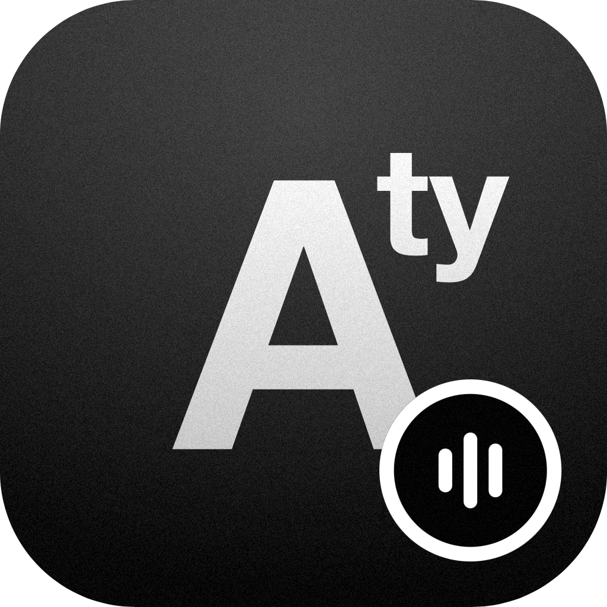
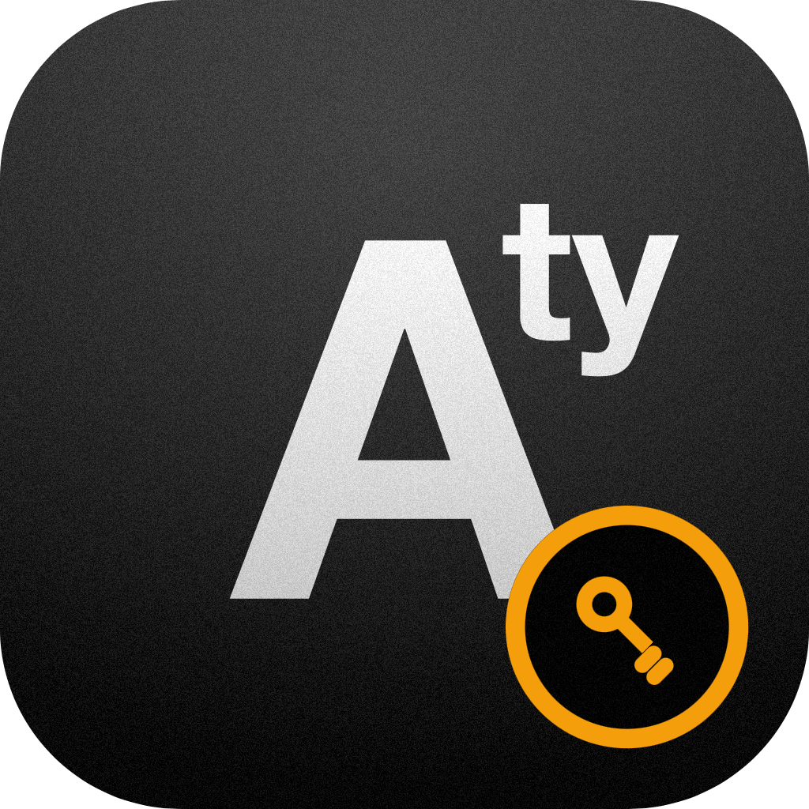
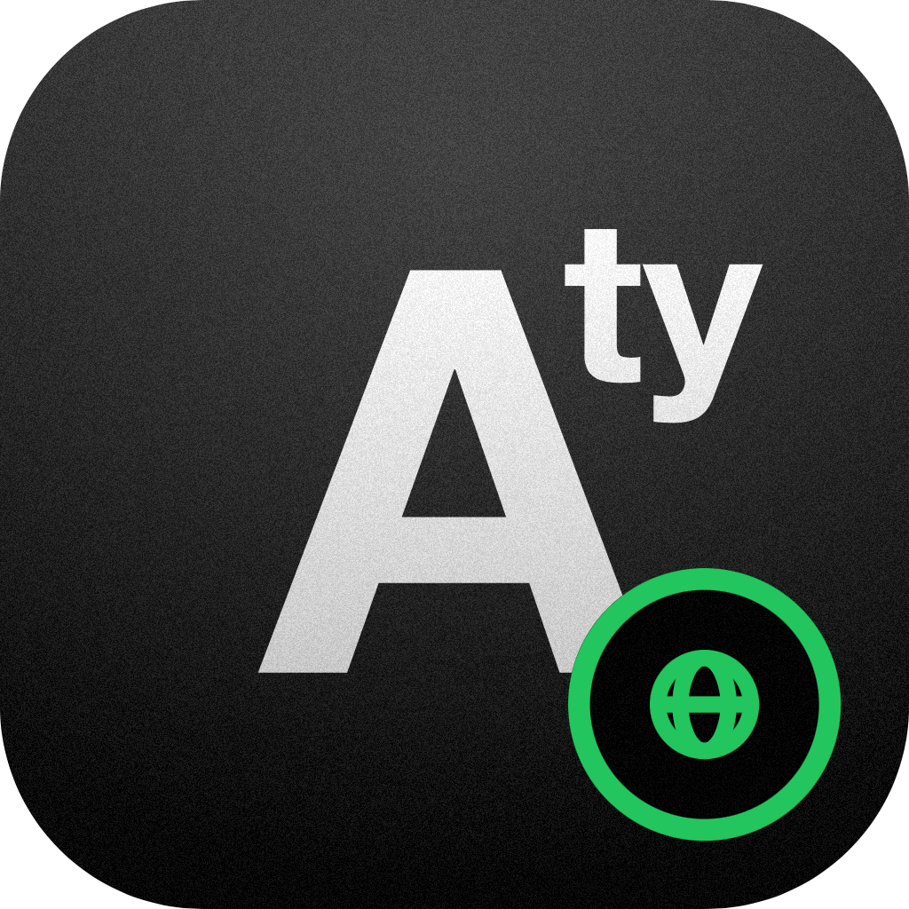

<p align="center">
  
</p>

<p align="center">
  <strong>Your streamer is your source. Audiogravi<sup>ty</sup> is the conductor.</strong>
  <br/>
  A native iOS / Android app (PWA) to pilot every audio engine your streamer runs —<br/>
  MPD, Roon Bridge, HQPlayer NAA, AirPlay, UPnP — all the way down to the RT kernel.
  <br/><br/>
  <a href="https://audiogravity.app"><strong>audiogravity.app →</strong></a>
</p>

<p align="center">
  
  
  
  
  
</p>

<p align="center">
  <a href="#features">Features</a> ·
  <a href="#architecture">Architecture</a> ·
  <a href="#requirements">Requirements</a> ·
  <a href="#editions">Editions</a> ·
  <a href="#quick-install">Install</a> ·
  <a href="#updating">Updating</a> ·
  <a href="#the-audiogravity-ecosystem">Ecosystem</a> ·
  <a href="#support">Support</a> ·
  <a href="#license">License</a>
</p>

---

## Features

<table>
  <tr>
    <td width="50%">

**Audio Control**
- Unified transport across MPD, Roon, HQPlayer NAA, AirPlay and UPnP
- UPnP Control Point — discover and cast to any network renderer (amplifiers, streamers, DLNA speakers) at full resolution, bit-perfect, with a live "Up next" queue
- UPnP renderer mode via upmpdcli — control AG from BubbleUPnP, Kazoo or any OpenHome control point
- Fullscreen Now Playing — cover art, seekable progress bar, transport controls, album tracklist, multi-source swipe, dynamic background
- HQPlayer DSP remote — filter, shaper, output mode, volume with auto-discovery
- Output steering — USB, Toslink, HDMI
- One-tap profile scenarios (switch entire audio chains instantly)
- Bit-perfect lock with DSD volume protection
- Sleep timer

</td>
    <td width="50%">

**Library & Radio**
- High-resolution browsing — Roon, MPD, MinimServer, Qobuz, Tidal, HIGHRESAUDIO
- Cast your local NAS / USB library to a network UPnP renderer, just like the streaming services
- Qobuz Hi-Res streaming up to 24-bit / 192 kHz — favourites, new releases, editorial playlists
- Tidal HiFi streaming — lossless FLAC, Favorites, New Releases, Charts, Editorial playlists, in-track seek
- HIGHRESAUDIO streaming — native-master FLAC up to 24-bit / 352.8 kHz — Favorites, Discover, Editor's Picks, Bestsellers, search
- Internet radio — Radio Browser, custom stations, favourites
- UPnP server auto-discovery & browsing

</td>
  </tr>
  <tr>
    <td>

**System & Performance**
- Live signal-path visualisation of your entire Hi-Fi chain
- Config editor — diff preview, backups, conditional restart
- RT scheduling, CPU pinning, per-core governor control — via systemd drop-ins
- µs-scale latency benchmarks from the browser
- Service monitoring with 60s sparklines
- Audio device inventory (ALSA cards, USB DACs)
- Guided audio setup — auto-detect DAC + library, generate bit-perfect MPD / AirPlay / UPnP configs in a couple of clicks
- One-click self-update — update to the latest release from the browser, no terminal (health-checked, automatic rollback)
- Audio software manager — install, update, configure
- Admin terminal — interactive shell in the browser

</td>
    <td>

**Security & Access**
- WebAuthn / passkeys login
- Multi-user with role-based access (admin, user, guest)
- Push notifications (iOS, Android, desktop)
- PWA-installable on iOS and Android
- No cloud account — fully self-hosted

</td>
  </tr>
</table>

> **Note:** Qobuz, Tidal and HIGHRESAUDIO streaming require an active subscription to their respective services — [Qobuz Studio or Sublime](https://www.qobuz.com) · [Tidal HiFi](https://tidal.com) · [HIGHRESAUDIO](https://www.highresaudio.com). Audiogravi<sup>ty</sup> does not provide access to these services. Qobuz, Tidal and HIGHRESAUDIO, and their respective logos, are trademarks of their respective owners; Audiogravi<sup>ty</sup> is not affiliated with, endorsed by, or sponsored by them.

## Architecture

Audiogravi<sup>ty</sup> doesn't replace the engines audiophiles trust — it **orchestrates** them across five layers of your streaming stack:

| Layer | What | Audiogravi<sup>ty</sup>'s role |
|-------|------|---------------------|
| **5 · Interface** | Browser · phone · tablet · PWA | Owns |
| **4 · Orchestration** | Source switching · transport · volume · UPnP renderer control · monitoring | Owns |
| **3 · Content sources** | NAS · Qobuz · Tidal · HIGHRESAUDIO · internet radio · MinimServer | Connects |
| **2 · Audio engine** | MPD · Roon Bridge · HQPlayer NAA · AirPlay · upmpdcli · UPnP renderers | Installs, configures & drives |
| **1 · OS / kernel** | RT scheduling · CPU pinning · IRQs · ALSA | Tunes |

It **installs and configures** the on-host daemons (MPD, upmpdcli, AirPlay), **drives** the ones that run elsewhere (Roon, HQPlayer, network renderers), **connects** your content sources, and **tunes** the OS kernel underneath — without replacing or hiding any of them.

## Requirements

- **Host** — a Linux server: DietPi or Debian / Ubuntu, on **x86_64** or **aarch64** (Raspberry Pi)
- **Audio output** — any ALSA-visible device: USB DAC, HAT, HDMI, S/PDIF…
- **Network** — a local network; any browser (phone, tablet, laptop) reaches the UI
- **Optional** — a public HTTPS **domain** for passkeys (WebAuthn) and Web Push
- **Streaming** — an active subscription only for the services you use (Qobuz, Tidal, HIGHRESAUDIO)

## Editions

| Edition | Price | What it unlocks |
|---------|-------|-----------------|
| **Trial** | Free · 30 days | Full access to every Pro feature |
| **Starter** | Free · forever | Profiles, Services, Audio Software, System, Users |
| **Pro** | €49 lifetime · 1 machine | Pipeline, Player, Library, Config, Performance |

Pro is a lifetime license — no subscription, no renewal. See [EDITIONS.md](EDITIONS.md) and [EULA.md](EULA.md). Licensing details in [License](#license) below.

## Quick install

```bash
# Recommended — all-in-one (core + ui on the same box)
curl -fsSL https://audiogravity.app/install.sh | sudo bash -s -- --token ghp_xxx

# Advanced — core and ui separately (e.g. ui on a different host)
curl -fsSL https://audiogravity.app/install-core.sh | sudo bash -s -- --token ghp_xxx
curl -fsSL https://audiogravity.app/install-ui.sh | sudo bash -s -- --token ghp_xxx
```

> **One-click self-update** covers a **co-located** core + ui (the recommended all-in-one
> setup): one action updates the whole box. A **split install** (core and ui on different
> hosts) is not auto-updated end-to-end — update each side by re-running its installer.

> The token is shared during **early access** with approved testers. [Request access →](mailto:contact@audiogravity.app?subject=Audiogravity%20-%20Early%20access%20request)

### Options

The core installer accepts two optional flags:

- **`--vapid-email`** — contact address for Web Push (the VAPID `sub`). If
  omitted, a generic placeholder is used and the installer prints a warning.
- **`--public-url`** — the public URL your users open Audiogravi<sup>ty</sup> from. The
  installer derives the WebAuthn origin and Relying Party ID from it, enabling
  **passkeys** (Face ID / Touch ID / Windows Hello). Passkeys require a real
  HTTPS **domain** — they do **not** work over a bare IP address, which browsers
  reject. Omit this flag if you don't use passkeys.

```bash
curl -fsSL https://audiogravity.app/install-core.sh | sudo bash -s -- \
    --token ghp_xxx \
    --vapid-email you@example.com \
    --public-url https://audiogravity.example.com
```

| Flag            | Sets                                         | Example                            |
|-----------------|----------------------------------------------|------------------------------------|
| `--vapid-email` | VAPID `sub` (push contact)                   | `you@example.com`                  |
| `--public-url`  | `WEBAUTHN_ORIGIN` + derived `WEBAUTHN_RP_ID` | `https://audiogravity.example.com` |

> Use the exact origin your browser shows (scheme + host + port).
> `--public-url https://ag.example.com:8443` → `WEBAUTHN_ORIGIN=https://ag.example.com:8443`
> and `WEBAUTHN_RP_ID=ag.example.com`. To share passkeys across sub-domains, set a
> parent `WEBAUTHN_RP_ID` (e.g. `example.com`) manually in
> `/opt/audiogravity/core/.env` and restart the core.

## Updating

- **One-click** — when a newer release is available, the Admin page shows an update banner. One action (with your admin password) downloads it, swaps the binary, health-checks the new version and **rolls back automatically** on failure — no terminal. On an all-in-one box, core and ui update together.
- **Manual** — re-run the installer(s) above; your configuration (`.env`) is preserved.

> One-click self-update covers a **co-located** core + ui (mono-host / all-in-one). A **split install** (core and ui on different hosts) is updated per-side — re-run each installer.

**Uninstall** — `sudo /opt/audiogravity/uninstall.sh` (core) · `sudo /var/www/audiogravity-ui/uninstall.sh` (ui).

## Install as PWA

<details>
<summary><strong>iOS (Safari)</strong></summary>

1. Open **Safari** → navigate to your Audiogravi<sup>ty</sup> URL
2. Tap **Share** (square with arrow)
3. **Add to Home Screen** → **Add**
4. Open from home screen — runs fullscreen

> iOS requires Safari. Chrome/Firefox on iOS cannot install PWAs.
</details>

<details>
<summary><strong>Android (Chrome)</strong></summary>

1. Open **Chrome** → navigate to your Audiogravi<sup>ty</sup> URL
2. Tap **⋮** menu → **Add to Home screen** or **Install app**
3. Tap **Install**
4. Open from home screen — runs fullscreen
</details>

## The AudioGravity ecosystem

Three components, three official logos:

<table>
  <tr>
    <td align="center" width="33%"></td>
    <td align="center" width="33%"></td>
    <td align="center" width="33%"></td>
  </tr>
  <tr>
    <td align="center"><strong>Audiogravi<sup>ty</sup> app</strong><br/>The streamer control app — <a href="https://github.com/audiogravity/audiogravity.ui">ui</a> (MIT) + core (proprietary)</td>
    <td align="center"><strong>Audiogravi<sup>ty</sup> admin server</strong><br/>Licence activation, download portal &amp; fleet update signal</td>
    <td align="center"><strong>Audiogravi<sup>ty</sup> site</strong><br/>This landing page &amp; release distribution</td>
  </tr>
</table>

## Test report

| Suite | Tests | Status |
|-------|------:|--------|
| Core | 1002 | ✅ |
| UI | 363 | ✅ |
| **Total** | **1365** | ✅ |

Last run: 2026-07-06 10:53 UTC

See [TEST_REPORT.md](TEST_REPORT.md) for the full per-test breakdown.

## Documentation

- [RELEASE_NOTES.md](RELEASE_NOTES.md) — synthesized release notes per version
- [CHANGELOG.md](CHANGELOG.md) — detailed changelog (single source of truth)
- [EDITIONS.md](EDITIONS.md) · [EULA.md](EULA.md) — editions and end-user licence agreement
- [THIRD_PARTY_NOTICES.md](THIRD_PARTY_NOTICES.md) — open-source components and license attributions
- [FAQ →](https://audiogravity.app/#faq) — frequently asked questions

## Support

- **Bug reports & questions** — [open an issue](https://github.com/audiogravity/audiogravity.site/issues)
- **Early-access token** — [request access](mailto:contact@audiogravity.app?subject=Audiogravity%20-%20Early%20access%20request)
- **Website** — [audiogravity.app](https://audiogravity.app)

## Roadmap

Audiogravi<sup>ty</sup> is in **early access** — **public beta** scheduled for **Summer 2026**. On the horizon: multi-room fanout and an AirPlay sender.

## Contributing

The interface — [audiogravity.ui](https://github.com/audiogravity/audiogravity.ui) — is **MIT-licensed** and open to contributions: issues and pull requests welcome. The core engine is proprietary (shipped as a compiled binary) and not open for external PRs.

## License

Audiogravi<sup>ty</sup> uses a **dual-license** model:

- **Interface** ([audiogravity.ui](https://github.com/audiogravity/audiogravity.ui)) — [MIT](https://github.com/audiogravity/audiogravity.ui/blob/main/LICENSE). Open source — fork it, contribute, or build on it.
- **Core engine** ([audiogravity.core](https://github.com/audiogravity/audiogravity.core)) — Proprietary. Distributed as a compiled binary under the [EULA](EULA.md).

Audiogravi<sup>ty</sup> also incorporates open-source components — see [THIRD_PARTY_NOTICES.md](THIRD_PARTY_NOTICES.md).

> [Qobuz](https://www.qobuz.com), [Tidal](https://tidal.com) and [HIGHRESAUDIO](https://www.highresaudio.com), and their respective logos, are trademarks of their respective owners; Audiogravi<sup>ty</sup> is not affiliated with, endorsed by, or sponsored by them.
