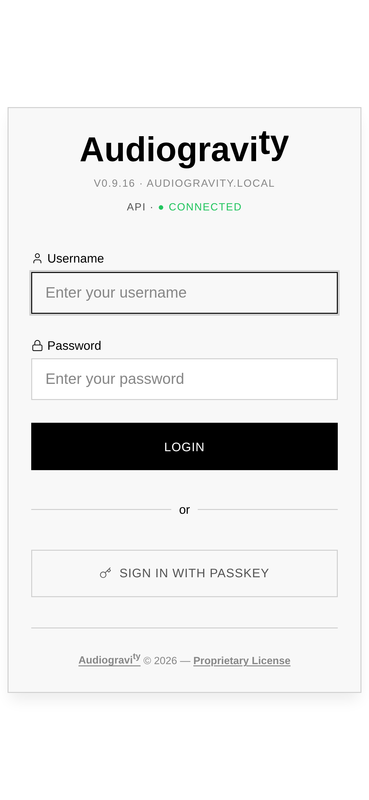
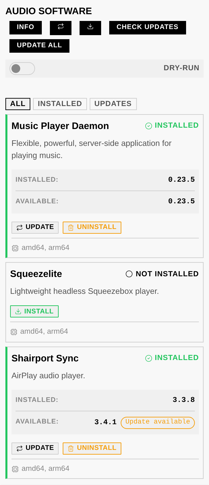
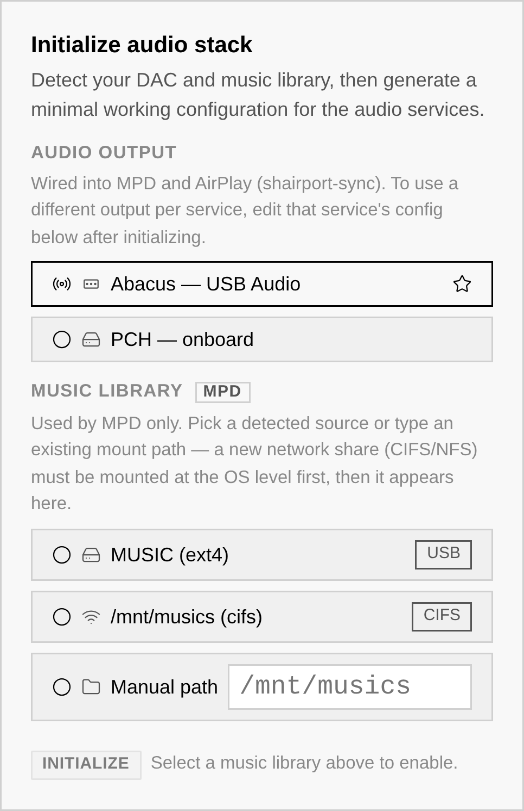
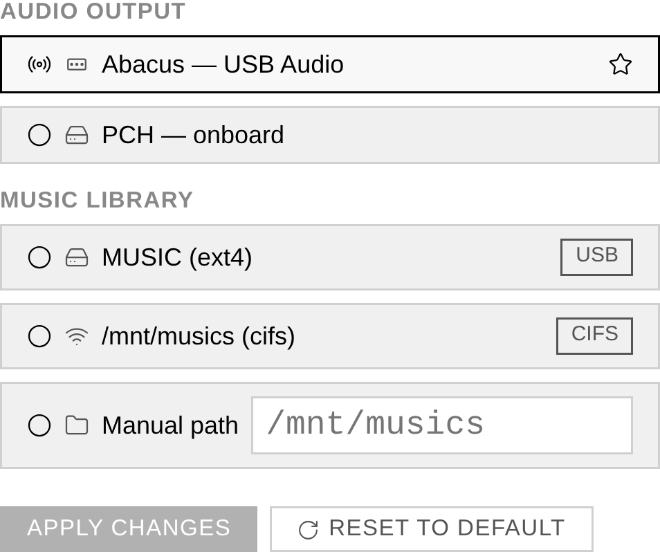

# 3. First run — guided audio setup

The first time you open Audiogravi<sup>ty</sup>, a few guided steps take you from a bare box to
music playing — without touching a config file.

## 1. Your trial activates automatically

A **30-day trial** — full access to every Pro feature — is activated on first run.
No action required, no card. When it ends you can keep using the free **Starter**
features or buy a **lifetime** licence (see [7. Administration → Licence](07-administration.md)).

## 2. Sign in — and secure your account

Audiogravi<sup>ty</sup> ships with one administrator account: username **`admin`**,
password **`admin123`**. Sign in with it, then **change the password right away**
(**Admin** tab → your user card) — the default is public knowledge.

After your first password login, Audiogravi<sup>ty</sup> offers to register a
**passkey** on the device — Face ID, Touch ID, a fingerprint or a hardware key.
Accept, and every later login becomes a tap: the login screen recognises the device
and asks for the passkey directly, with *Use password instead* as the fallback.
(Passkeys require Audiogravi<sup>ty</sup> to be reachable over a real HTTPS
**domain** — see the `--public-url` flag in [2. Installation](02-installation.md).)

More accounts — family members, a read-only guest — can be added later from the
**Admin** tab (see [7. Administration](07-administration.md#users--access)).



## 3. Install the audio engines

The installer sets up Audiogravi<sup>ty</sup> itself — **not** the audio engines it
conducts. On a fresh box, install those first from the **Audio Software** tab (see
[7. Administration → Audio Software](07-administration.md#audio-software)): each
engine has a card with an **INSTALL** button.

- **Music Player Daemon (MPD)** — the core player. Install this one first: it plays
  your local library **and** carries Qobuz, Tidal, HIGHRESAUDIO and internet radio.
- **Shairport Sync** — to receive **AirPlay**.
- **UPnP Bridge** (upmpdcli) — to expose the box as a **UPnP renderer** other apps
  can cast to.
- **Roon Bridge / Roon Server / HQPlayer NAA** — only if you use Roon or HQPlayer.

Install what you need now — you can always come back for the rest later.



## 4. Configure the audio stack (guided)

On a new box, the **Config** tab shows an **Initialize audio stack** panel
(administrators only). It:

1. **Auto-detects** your DAC and your music library.
2. **Generates a minimal, bit-perfect configuration** for the three audio services —
   **MPD** (local library), **AirPlay** (shairport-sync) and **UPnP** (upmpdcli) —
   all wired to the output you choose.
3. Asks for your **admin password** before applying.

Once at least one service is set up, the panel disappears and each MPD / AirPlay /
UPnP tile shows a **CONFIGURED** badge.



> **Why "bit-perfect"?** The generated configs send audio to your DAC untouched — no
> resampling, no volume math in the digital domain — so what your DAC receives is
> exactly what the file contains.

### The DAC stays put

When you configure a USB DAC, Audiogravi<sup>ty</sup> **pins its sound-card index** at the OS
level. Linux then always gives that DAC the same number, even after a reboot or a
USB re-plug — so the output your services target never drifts and nothing needs
re-checking at startup.

### Per-service outputs

Each service can target its **own** output. For example: MPD on your USB hi-res DAC,
AirPlay on the optical out. Change any service's output later from the **Guided**
editor (see below) in a couple of clicks.

### Music on a NAS? Mount the share first

The **Music library** picker lists what the box can already see: **USB drives**
(ext4 / exFAT) and **existing mounts** — any network share (CIFS/SMB, NFS) plus
local mounts under `/mnt`. A NAS share must therefore be **mounted at the OS level
first**; Audiogravi<sup>ty</sup> then detects it automatically. One-time setup, from
a terminal on the box:

```bash
# 1. Create a mount point
sudo mkdir -p /mnt/music

# 2a. CIFS / SMB (a typical NAS share) — the quoted heredoc keeps
#     special characters in the password intact
sudo tee /root/.smbcredentials >/dev/null <<'EOF'
username=nasuser
password=naspass
EOF
sudo chmod 600 /root/.smbcredentials
echo "//192.168.1.20/music /mnt/music cifs credentials=/root/.smbcredentials,ro,vers=3.0,_netdev 0 0" \
    | sudo tee -a /etc/fstab

# 2b. — or NFS
echo "192.168.1.20:/volume1/music /mnt/music nfs ro,_netdev 0 0" | sudo tee -a /etc/fstab

# 3. Mount and verify
sudo systemctl daemon-reload && sudo mount -a && ls /mnt/music
```

`_netdev` makes the mount wait for the network at boot, and `ro` (read-only) is a
sensible default for a music library. Back in the **Initialize** panel (or the
Guided editor), hit refresh — the share now appears as a library choice.

## 5. Change output or library later (Guided mode)

For MPD, AirPlay and UPnP, the Config editor opens in a **Guided** view where you
change the **audio output** or **music library** in a couple of clicks. Only the
setting you touch is rewritten — the rest of your config is preserved. A **Reset to
default** action regenerates a clean minimal config (admin password required; your
current file is backed up first).



## 6. Find your way around

The **tab bar** (across the top, or a sidebar in the vertical layout) is the app's
map:

- **Profiles · Services · Audio Software · Systemd · Performance · Config ·
  System** — running the box: audio scenarios, service control, engine installs,
  OS tuning, config files and monitoring (all covered in
  [7. Administration](07-administration.md)).
- **Pipeline** — the live signal-path view (Pro; see
  [6. Outputs & engines](06-outputs-engines.md)).
- **Library** (Pro) — browse, search, queue, sources and outputs: where you play
  music.
- **Admin** — users and access, announcements, updates and the licence.
- **Manual** — this manual, readable inside the app.

On a **Starter** licence the Pro tabs carry a small lock — tapping one opens the
licence panel. The sticky **Now Playing bar** sits above the footer whatever the
tab, and the **gear** in the top bar opens
[Settings](07-administration.md#the-settings-panel).

## 7. Install it as an app (recommended on phones)

Audiogravi<sup>ty</sup> is an installable web app (PWA): added to your home screen it
opens **fullscreen**, in its own window, with the app icon.

- **Android** — open the site in Chrome and accept the **Install app** prompt (or
  browser menu → *Add to Home screen*). The installed app also honours the
  [Portrait Lock](04-listening.md#portrait-lock) at the OS level.
- **iPhone / iPad** — in Safari, tap **Share → Add to Home Screen**. On iOS this is
  also **required for push notifications**: Safari tabs can't receive them, the
  installed app can (see
  [7. Administration → Push notifications](07-administration.md#push-notifications)).
- **Desktop** — Chrome and Edge offer an install icon in the address bar; handy for
  a dedicated always-open controller window.

## Next

Your box now plays. Head to **[4. Listening](04-listening.md)** to start playing
music, or **[5. Library & streaming](05-library-streaming.md)** to connect Qobuz,
Tidal, HIGHRESAUDIO and internet radio.
