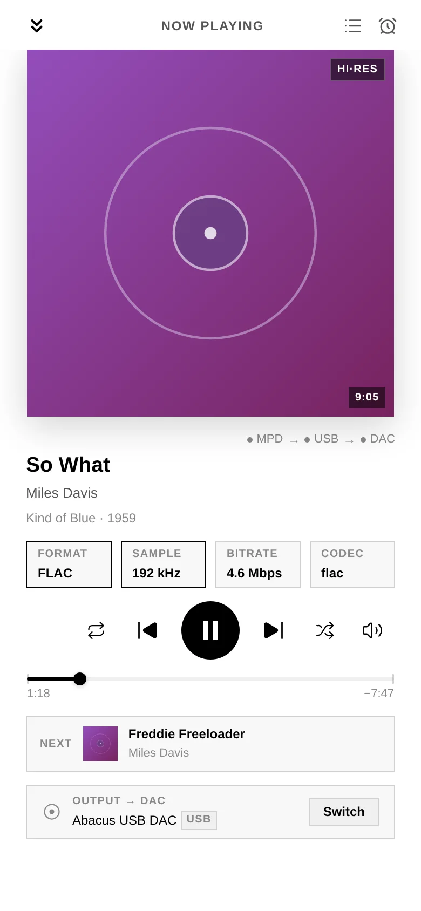
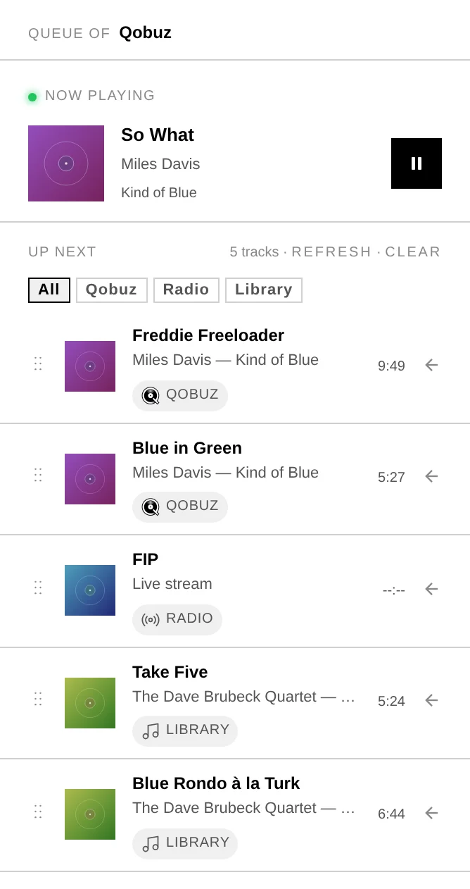
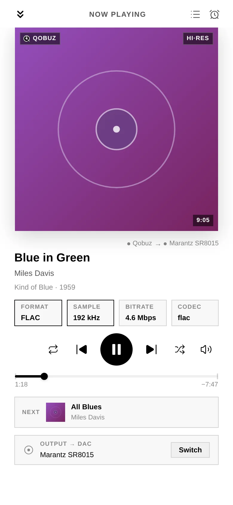

# 4. Listening

Once your box is set up, playing music is the same whatever the source — local files,
Qobuz, Tidal, HIGHRESAUDIO, internet radio or a UPnP server all flow through one set
of controls.

## The Now Playing bar

A sticky **Now Playing** bar sits above the footer and shows **all active audio
sources** at once, with quick transport — play/pause, next, and volume. Tap it (or
swipe up on mobile / the expand button on desktop) to open the **fullscreen player**.

## The fullscreen player

- **Cover art** with a dynamic background derived from it, a **seekable progress
  bar**, and full **transport**: repeat · previous · play/pause · next · shuffle.
- **Album details** — Album, Artist, Format, Genre, Year, Position, Source and the
  full **Tracklist**.
- A **Queue** view for what's coming up (see below).
- **Swipe** between active sources; close with the back button or swipe-down.
- When playing to a network renderer, a **"Routed to UPnP renderer"** indicator makes
  the destination clear.

## The Queue

The **Queue** view shows the current track and what's coming up — for every source,
including **Qobuz, Tidal and HIGHRESAUDIO** albums, with their real titles and artists
(they survive a restart of the box, too).

- The header names the **actual source** — playing internet radio reads "Radio" and
  shows the **station's logo**, not the underlying playback engine. The same holds
  when you **cast to a network speaker**: the badge names where the music comes from
  (**Qobuz**, **Library**, your media server's name), and the speaker appears as the
  **output** — because it is the destination, not the source.
- A badge reading **External** means the music was **not started from
  Audiogravity** — someone is driving your speaker, or HQPlayer, from another app
  or its own remote. Audiogravity shows what it can see and stays out of the way.
- When the queue **mixes sources** — say a radio station followed by a Qobuz album —
  each upcoming track carries a small **source badge** telling you where it comes
  from, and a **filter bar** lets you view one source at a time. Filtering only
  changes what you *see*: nothing moves or stops playing, and the current track
  always stays in view.
- Remove an upcoming track with its **Remove** button or a **left-swipe** — the same
  gesture used across the app's lists. It always removes the track you swiped, even
  if the queue has reordered meanwhile. **Clear** empties the queue, and respects the
  active filter.

## The live hi-fi readout

On every track change, Audiogravity shows exactly what's reaching your DAC:

- **Format** (PCM / DSD), **sample rate**, **bit depth**, and instantaneous **bitrate**.

This is your at-a-glance confirmation that a Hi-Res track really is playing at its
native resolution. A DSD lock indicator appears for DSD streams.

## The stream-origin badge

A badge in the Now Playing bar always tells you **where the audio is coming from** —
Tidal, Qobuz, HIGHRESAUDIO, your UPnP server (by name), a radio station, a local file,
or AirPlay. No guessing which source is live.

## Profiles — switch whole chains in one tap

A **profile** is a saved scenario for your audio system. Switching one automatically
**starts the services it needs and stops the conflicting ones**, so the chain is
always coherent and bit-perfect. Typical profiles: *Roon + HQPlayer* for serious
listening, *MPD + upmpdcli* to expose the box as a UPnP renderer, *AirPlay only* for
background music.

Each profile tile shows the services it starts/stops, the resolved output port (e.g.
`usb`, `toslink`), a live **health bar** (active / failed / idle), and when it was
last activated. Activation is atomic, with a detailed toast on failure.

## Sleep timer

A built-in sleep timer pauses playback after a set duration — for falling asleep to
music without leaving the system running all night.

## Portrait lock

On phones and tablets, Audiogravity stays in **portrait** by default. A
**Portrait Lock** switch in **Settings** (the gear in the top bar) turns it off if
you prefer landscape — and on a device you can't rotate, the *Continue in landscape*
button on the rotate screen lets you carry on (it switches the lock off for you).
Desktop installs are unaffected.

## Where the audio goes

Choosing **where** music plays — your local DAC, a network renderer, HQPlayer or
AirPlay — is covered in **[6. Outputs & engines](06-outputs-engines.md)**. Connecting
streaming services and browsing your library is in
**[5. Library & streaming](05-library-streaming.md)**.
