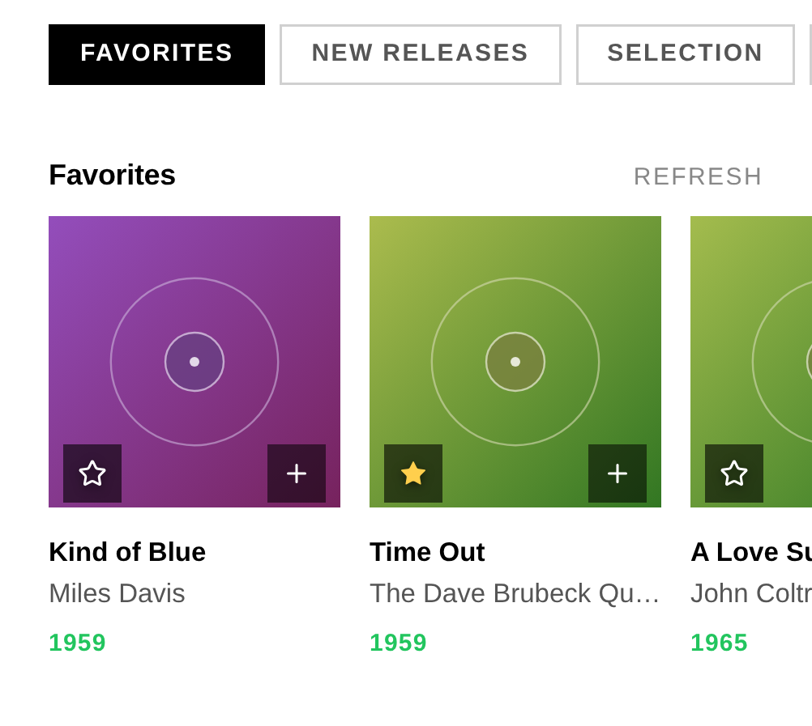

# 5. Library & streaming

Browse everything from one interface: your local files, your UPnP/DLNA media servers,
and the streaming services — Qobuz, Tidal and HIGHRESAUDIO — side by side. Search
results are directly playable, with titles and cover art. Pick a track, pick an
output, and the music flows at full resolution.

## How the Library tab is organised

The Library tab holds several views:

- **Browse** — albums for the active source, with infinite scroll.
- **Search** — full-text across artists, albums and tracks. Tapping an **artist**
  opens that artist's albums — across your local library, Qobuz, Tidal and
  HIGHRESAUDIO — with a back control to return to your results.
- **Sources** — pick the active source (local, streaming, Roon zone, UPnP server).
- **Outputs** — pick where the audio goes (see [6. Outputs & engines](06-outputs-engines.md)).
- **Queue** — what's playing and coming up.

## Your local library

Files on your NAS or USB drive (served by MPD) appear as a browsable, searchable
source — album view with infinite scroll, full-text search, queue management. You can
also **cast local files to a network renderer**, just like a streaming service (see
[6. Outputs & engines](06-outputs-engines.md)).

## UPnP / DLNA media servers

In **Sources**, Audiogravity lists the UPnP media servers it already knows and lets
you run a **manual scan** to discover more (e.g. **MinimServer**); found servers are
saved automatically, and a **left-swipe** removes a saved server you no longer use.
Browse any server's tree (ContentDirectory); results play directly, with metadata
and art.

## Roon

Connect a Roon source in **Sources**; it expands to show the available **zones**.
A dedicated Roon browser navigates the Roon library hierarchy.

## Streaming services

All three deliver native-resolution audio through their **official APIs**. Each
requires **your own active subscription** — Audiogravity provides no access itself.

Connect them from **Library → Sources**: open the service's card, sign in, and the
session is kept alive and refreshed for you. Each card shows its connection state and
a disconnect action.

### Qobuz

Tap **Connect** — an **OAuth2** login opens; sign in and Qobuz redirects back
automatically, and the card switches to **Connected**. Browse via category pills —
**Favorites**, **New Releases**, **Selection**, **Playlists** — plus full search.
Hi-Res up to 24-bit / 192 kHz.

### Tidal

Tidal uses the **PKCE** flow: tap **Connect**, sign in, and Tidal lands on a fixed
redirect page (`tidal.com/android/login/auth?code=…`) that a web app can't intercept —
so **copy that full URL** from the address bar, paste it back into the Tidal card and
tap **Finish login**. You only do this once. Lossless FLAC (HiFi / HiFi Plus);
Favorites, New Releases, Charts, editorial playlists, in-track seek.

### HIGHRESAUDIO

Simpler still — enter your account **email and password** directly in the card (its
official API, no redirect, no copy-paste). Native-master FLAC up to 24-bit /
352.8 kHz; Favorites, Discover, Editor's Picks, Bestsellers, search. Your password is
stored encrypted on the device.

> **One device per HRA account.** HIGHRESAUDIO allows a single active device — connecting
> Audiogravity signs you out of your other HRA players.

### Favorites — star an album from the app

On Qobuz, Tidal and HIGHRESAUDIO albums, a **star** — on the album card in the browse
grid and on search results — adds the album to (or removes it from) **your favorites
on that service**, with one tap. The star is filled when the album is already a
favorite, updates instantly, and stays in sync between browsing and search.

### Subscriptions at a glance

| Service | For Hi-Res you need |
|---------|---------------------|
| Qobuz | Qobuz **Studio** or **Sublime** |
| Tidal | Tidal **HiFi** or **HiFi Plus** |
| HIGHRESAUDIO | an active **HIGHRESAUDIO** subscription |

## Internet radio

Internet radio is a **first-class source** — stations flow through the same transport
as your FLAC library, route to the same output, and show the same hi-fi readout. The
radio view has three sub-tabs:

- **My Live Radio** — your own collection (custom stations + saved hits). The default
  tab; it hosts the **Add custom station** form. A brand-new box arrives with a few
  starter stations (FIP, Classic Vinyl HD…) already here — keep them or remove them.
  An upgrade never touches your collection.
- **Favorites** — your starred stations.
- **Search** — a query box with **country**, **genre** and **Hi-Res** filters, backed
  by the Radio Browser catalogue.

On each station card: **tap** to play, the **star** toggles Favorites, the **+**
toggles My Live Radio, the **pencil** edits a custom station, and a **left-swipe**
removes it from the current list.
