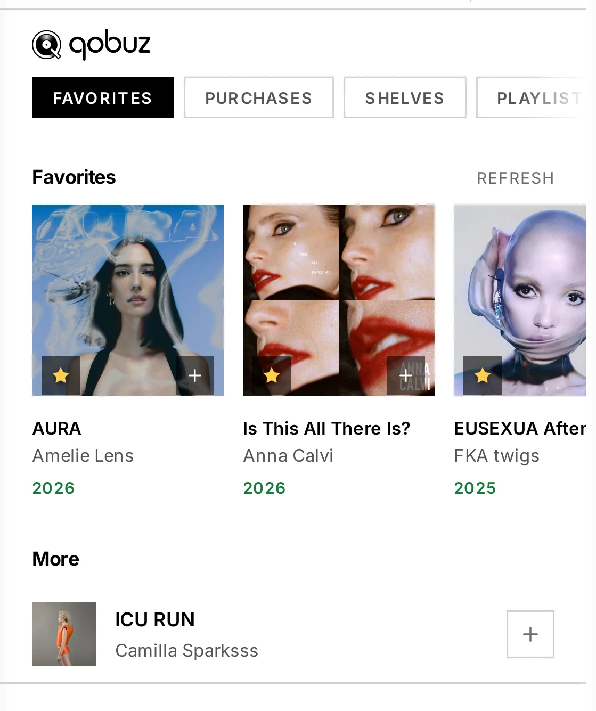

# 5. Library & streaming

Browse everything from one interface: your local files, your UPnP/DLNA media servers,
and the streaming services — Qobuz, Tidal and HIGHRESAUDIO — side by side. Search
results are directly playable, with titles and cover art. Pick a track, pick an
output, and the music flows at full resolution.

## How the Library tab is organised

The Library tab holds several views:

- **Browse** — albums for the active source, with infinite scroll.
- **Search** — full-text across artists, albums and tracks. Tapping an **artist**
  opens that artist's albums — across your local library, Qobuz, Tidal and
  HIGHRESAUDIO — with a back control to return to your results.
- **Sources** — pick the active source (local, streaming, Roon zone, UPnP server).
  Connecting or disconnecting a service updates this list straight away. Outputs
  never appear here: a network speaker and HQPlayer are destinations, not places to
  browse — they live in **Outputs**.
- **Outputs** — pick where the audio goes (see [6. Outputs & engines](06-outputs-engines.md)).
- **Queue** — what's playing and coming up.

## Your local library

Files on your NAS or USB drive (served by MPD) appear as a browsable, searchable
source — album view with infinite scroll, full-text search, queue management. You can
also **cast local files to a network renderer**, just like a streaming service (see
[6. Outputs & engines](06-outputs-engines.md)).

## UPnP / DLNA media servers

In **Sources**, Audiogravity lists the UPnP media servers it already knows and lets
you run a **manual scan** to discover more (e.g. **MinimServer**); found servers are
saved automatically, and a **left-swipe** removes a saved server you no longer use.
Browse any server's tree (ContentDirectory); results play directly, with metadata
and art.

## Roon

Connect a Roon source in **Sources**; it expands to show the available **zones**.
A dedicated Roon browser navigates the Roon library hierarchy.

## Streaming services

All three deliver native-resolution audio through their **official APIs**. Each
requires **your own active subscription** — Audiogravity provides no access itself.

Connect them from **Library → Sources**: open the service's card, sign in, and the
session is kept alive and refreshed for you. Each card shows its connection state and
a disconnect action.

### Qobuz

Tap **Connect** — an **OAuth2** login opens; sign in and Qobuz redirects back
automatically, and the card switches to **Connected**. Browse via category pills —
**Favorites**, **New Releases**, **Selection**, **Playlists** — plus full search.
Hi-Res up to 24-bit / 192 kHz.

### Tidal

Tidal uses the **PKCE** flow: tap **Connect**, sign in, and Tidal lands on a fixed
redirect page (`tidal.com/android/login/auth?code=…`) that a web app can't intercept —
so **copy that full URL** from the address bar, paste it back into the Tidal card and
tap **Finish login**. You only do this once. Lossless FLAC (HiFi / HiFi Plus);
Favorites, New Releases, Charts, editorial playlists, in-track seek.

### HIGHRESAUDIO

Simpler still — enter your account **email and password** directly in the card (its
official API, no redirect, no copy-paste). Native-master FLAC up to 24-bit /
352.8 kHz. Your password is stored encrypted on the device.

> **One device per HRA account.** HIGHRESAUDIO allows a single active device — connecting
> Audiogravity signs you out of your other HRA players.

#### Browsing HIGHRESAUDIO

The bar carries **seven shelves** — **Favorites**, **Vault**, **Categories**,
**Charts**, **Playlists**, **Labels**, **Genres** — and each one opens a strip of its
own underneath. HIGHRESAUDIO asked for this arrangement and approved it: before, a
single row of eighteen buttons ran end to end in whatever order their API published
them, with most of the shop off the edge of the screen.

**Categories** holds the fourteen shop categories they publish — the six they named
first, in their order, then the other eight in theirs. The list comes from
HIGHRESAUDIO itself, so a category they add appears without an update to
Audiogravity.

Four of their titles come back in German whatever language is asked for — a quirk of
their API that their own application works around the same way. Those four are shown
in HIGHRESAUDIO's own English: *Neue Alben hinzugefügt* → **Recently Added**,
*Hörtipps* → **Listening Tips**, *Top Alben* → **Top Albums**, *Neuheiten* → **New
Release**.

**Charts** is the ranking their own front page shows.

**Labels** is the seven imprints HIGHRESAUDIO names — *2L* and *audite* among them.
Five of the seven serve the same albums as the matching *… Highlights* category: that
is their catalogue, not a fault, and nothing is hidden to make the two look different.

**Vault** is what you have **bought** from HIGHRESAUDIO, as opposed to what you stream.
The albums play in full without being downloaded, like any other — to your local
output, to a network renderer, through HQPlayer — and they stay yours whether or not a
subscription is running.

That last point has a consequence worth knowing: an account that only ever bought
albums, with no subscription at all, signs in perfectly well and is offered the Vault
**alone**. The shop, the favourites, the genres and the playlists would all refuse it,
so a bar offering them would only offer buttons that fail. The sources card says as
much next to the account name.

**Genres** is HIGHRESAUDIO's second way of arranging the same catalogue — 26 genres
and 186 sub-genres. It opens a second strip rather than lengthening the shelf bar:
pick a genre and the strip becomes that genre plus its own subdivisions, with **All**
standing for the whole genre. The heading above the albums says where you are —
*Soundtrack · Original Score*.

**Playlists** opens the same second strip with four ways in. **Editorial** is the
selections HIGHRESAUDIO publishes and **Mine** the playlists belonging to your
account; **Genre** and **Theme** are the two ways HIGHRESAUDIO files those same
editorial selections, offered here as they file them rather than as a third
collection. A playlist behaves like an album — open it to see its tracks, or send the
whole thing to the queue in one gesture — and says *Playlist* on its card, so a
selection is never mistaken for a record. Creating or editing playlists is not
available: what HIGHRESAUDIO has made is readable, what you make stays where you made
it.

The editorial collection runs to more than seventeen hundred selections, so a third
strip sorts them onto HIGHRESAUDIO's own shelves — **New Releases**, **Recommended**,
**Popular** and **Moods** — with **All** at the front, where it opens. All is not
merely a convenience: a handful of the older selections are filed under no shelf at
all, and the unfiltered view is the only one that holds them.

#### Narrowing a HIGHRESAUDIO search

Under the search box, **Advanced search** unfolds the form HIGHRESAUDIO's own
application offers, criterion for criterion: **Artist**, **Composer**, **Label**,
**Year**, **Format**, **Mood**, and the **order** results come back in. The eighth
criterion is the search box itself — the words you type — so there is one text field,
not two.

A criterion is a search on its own: you can leave the box empty, ask for the label
*ECM* and press **Search**. The form is applied by that button rather than as you
type, because a filtered search is the one slow thing HIGHRESAUDIO does — the first
time a given search is asked it can take the better part of a minute, and a second or
two every time after. When it runs out of patience the screen says so and invites you
to ask again, which usually answers at once.

Three things behave the way HIGHRESAUDIO's catalogue behaves, and are worth knowing
before they surprise you. **Year** is the year an album was put *online*, not the year
it was recorded: *Innuendo* is a 1991 record and answers to 2026. Choosing a
**format** makes their catalogue ignore the words typed — ask for *queen* in FLAC 192
and you get the same fifty albums as any other word — which is what their own
application does, so this one behaves like the app you already know. And a **mood**
currently changes nothing: measured on their catalogue, the same albums come back with
it, without it, and with a mood of the opposite family. All three have been reported
to them, and the form follows the day their catalogue answers differently.

An **order** arranges an answer, it does not produce one: choosing one on its own
returns nothing, and the form says so rather than searching.

### Favorites — star an album from the app

On Qobuz, Tidal and HIGHRESAUDIO albums, a **star** — on the album card in the browse
grid and on search results — adds the album to (or removes it from) **your favorites
on that service**, with one tap. The star is filled when the album is already a
favorite, updates instantly, and stays in sync between browsing and search.

### Subscriptions at a glance

| Service | For Hi-Res you need |
|---------|---------------------|
| Qobuz | Qobuz **Studio** or **Sublime** |
| Tidal | Tidal **HiFi** or **HiFi Plus** |
| HIGHRESAUDIO | an active **HIGHRESAUDIO** subscription |

## Internet radio

Internet radio is a **first-class source** — stations flow through the same transport
as your FLAC library, route to the same output, and show the same hi-fi readout. The
radio view has three sub-tabs:

- **My Live Radio** — your own collection (custom stations + saved hits). The default
  tab; it hosts the **Add custom station** form. A brand-new box arrives with a few
  starter stations (FIP, Classic Vinyl HD…) already here — keep them or remove them.
  An upgrade never touches your collection.
- **Favorites** — your starred stations.
- **Search** — a query box with **country**, **genre** and **Hi-Res** filters, backed
  by the Radio Browser catalogue.

On each station card: **tap** to play, the **star** toggles Favorites, the **+**
toggles My Live Radio, the **pencil** edits a custom station, and a **left-swipe**
removes it from the current list.

### Where the stations come from, and what is sent back

Search results come from [Radio Browser](https://www.radio-browser.info), a free,
community-run catalogue. It is not a service Audiogravity operates: it runs on
a single machine, and when it is unavailable — which does happen — search stops working
for as long as its own outage lasts. Your own stations are unaffected: **My Live Radio**
and **Favorites** are stored on your box and keep playing regardless. A search you have
already run also keeps showing its last results while the catalogue is unreachable, for
up to a day.

That catalogue ranks stations by how often they are played, and Audiogravity
sorts your search results by that ranking. Its documentation asks the software that uses
it to report each play, so it does: when you start a station, its identifier is sent to
Radio Browser, and nothing else — no account, no listening history, no information about
you or your box. Stations you added by hand are never reported, and neither is a station
that failed to start.

If you would rather nothing left your box at all, set `RADIO_REPORT_PLAYS=false` in
`/opt/audiogravity/core/.env` and restart the core
(`sudo systemctl restart ag-core-server`). Search and playback are unchanged by this;
only the report stops.

---

*Roon, HQPlayer, AirPlay, Qobuz, Tidal and HIGHRESAUDIO, and their respective logos, are
trademarks of their respective owners. Audiogravity is not affiliated with,
endorsed by, or sponsored by any of them: it interoperates with their software as a client,
and each remains the property of its owner.*
