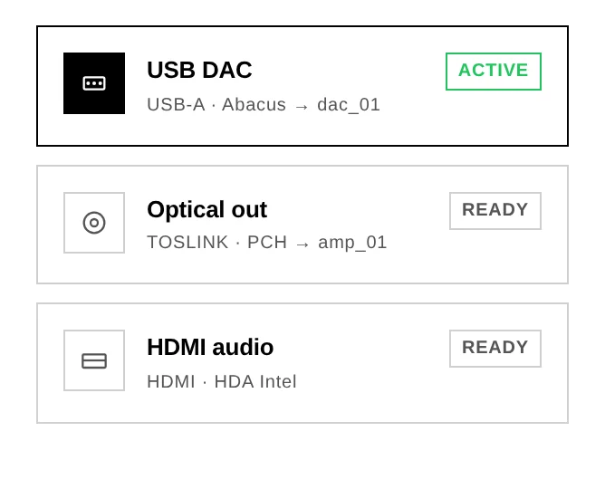
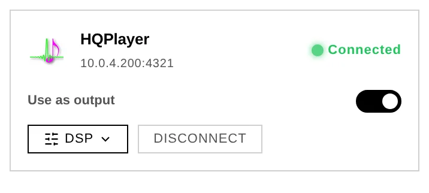

# 6. Outputs & engines

Audiogravi<sup>ty</sup> can send the same music to very different destinations — a locally
attached DAC, a network renderer across the room, HQPlayer's DSP engine, or an AirPlay
receiver. The **output selector** switches between them in one tap.

## The output selector

In **Library → Outputs**, Audiogravi<sup>ty</sup> lists every physical output the box exposes
(USB, optical, HDMI…) alongside the network renderers it has discovered, and switches
the active output when you pick one. Streaming and HQPlayer connections are managed
next to it in **Library → Sources**.




Switching is designed to be seamless. **MPD's output flips gapless** — over MPD's
control socket, without restarting the player — so there is no silence, and a cast
already playing keeps going on the new output. **AirPlay** is the exception: its
receiver has to restart to change output, so the panel warns you first that it will
interrupt any AirPlay session in progress. And when a switch does not take, the panel
tells you instead of pretending it worked — it shows the reason and rolls back to the
real state.

## Local DAC

The default: audio goes straight from MPD to the DAC attached to the box (USB, HAT,
HDMI, S/PDIF), bit-perfect and with no network round-trip. This is the purest path and
the one the guided setup wires up first.

## Network UPnP renderers

Audiogravi<sup>ty</sup> is a **UPnP Control Point**: it discovers every renderer on your LAN —
network amplifiers, dedicated streamers, DLNA speakers (Marantz, Linn…) — and drives
them directly from the interface. Browse a source, hit **Play**, and the stream
reaches the renderer at **full resolution, bit-perfect**, without touching the
server's own audio path.

- The output selector switches between physical DAC outputs and network renderers.
  A **left-swipe** on a renderer removes it from the known list (a renderer still on
  the network simply reappears at the next scan).
- A live **"Up next"** strip shows the track being loaded onto the renderer.
- Transport (next / prev / pause / seek / volume) is routed through the renderer that
  owns the queue.
- You can **cast your local NAS/USB library** to a network renderer too, exactly like
  a streaming service.

> **Your box's own renderer.** Audiogravi<sup>ty</sup> advertises itself on the network (via
> upmpdcli) so other apps can cast *to* it. That self-entry appears in the renderer
> list as a non-selectable *"This device · receives external casts"* row — because
> playing on the box is what the **Local DAC** output already does.

## HQPlayer

If you run **HQPlayer** on your network, Audiogravi<sup>ty</sup> integrates with it three ways:

- **DSP remote** — change the interpolation **filter**, **noise shaper**, output
  **mode** and **volume** on your HQPlayer instance from the interface. It's
  auto-discovered on the LAN — connect in one tap.
- **NAA endpoint** — the box can run HQPlayer's Network Audio Adapter so HQPlayer
  streams to it and out to your DAC.
- **As your output** — the **Use as output** switch on the HQPlayer card sends your
  library through HQPlayer's DSP engine instead of straight to the local DAC.

### Use as output



With the switch on, playing an album routes it to HQPlayer, which processes it and
sends it back to your DAC through the NAA. The player badges the track with where the
music actually comes from — **Library** — and the signal path shows the full chain:
*Library → HQPlayer → NAA → your DAC*. HQPlayer is a **processor** in that chain, not
the source of the music.

The setting lives **on the box, not in your browser**: turn it on from your phone and
your laptop shows it on too. Turning it off releases the sound card so local playback
works again immediately.

Audiogravi<sup>ty</sup> refuses to turn the switch on when nothing would come out — no HQPlayer
configured, or its NAA not running on the box — and tells you which of the two is
missing rather than sending your music into silence.

### What can and cannot go through HQPlayer

HQPlayer plays **FLAC, WAV, AIFF, WavPack, MP3, DSF and uncompressed DFF**. It does
**not** decode **AAC, ALAC, OGG/Opus, APE or WMA**.

This matters most for **internet radio**: many Hi-Res stations broadcast in AAC. When
you pick one while HQPlayer is your output, Audiogravi<sup>ty</sup> tells you straight away that
the station's format cannot be decoded — turn the switch off to listen to it on the
local output.

**Streaming services** (Qobuz, Tidal, HIGHRESAUDIO) cannot be routed through HQPlayer
yet either; you get the same clear message rather than silence. **Roon is unaffected** —
a Roon zone is its own output chain and never uses the sound card HQPlayer replaces.

> **One output at a time.** HQPlayer and a network renderer cannot both be your
> output. If both are selected, Audiogravi<sup>ty</sup> asks you to turn one off instead of
> guessing which device you meant.

## Roon

Audiogravi<sup>ty</sup> works with a **Roon Bridge** endpoint and connects to your remote **Roon
Core** for metadata and transport — so a Roon zone can sit alongside your other
outputs in the same interface.

**Setting it up.** Roon has no in-app settings screen and no installer flag — you point
Audiogravi<sup>ty</sup> at your Roon Core in the core's config file, then authorize it once inside
Roon:

1. **Point AG at the Core.** On the box, edit `/opt/audiogravity/core/.env` and set:
   ```
   ROON_ENABLED=true
   ROON_CORE_HOST=192.168.1.50    # the IP of the machine running Roon Core
   ```
   (The Core's control port `9330` is used automatically; leave `ROON_CORE_HOST` at the
   default only if the Core runs on the same box.)
2. **Restart the core** so it re-reads the file:
   ```bash
   sudo systemctl restart ag-core-server
   ```
3. **Authorize the extension in Roon.** Open Roon (the desktop or mobile app connected to
   your Core) → **Settings → Extensions**. An extension named **“Audiogravity”** appears
   in the list — click **Enable** next to it. That's the one-time authorization: Roon
   grants AG a token, AG stores it, and it reconnects on its own afterwards (no need to
   re-authorize on restarts).

> If `ROON_CORE_HOST` is wrong or the Core is unreachable, the core logs a connection
> warning and keeps retrying — correct the IP in `.env` and restart. Until you click
> **Enable** in Roon (step 3), the connection stays unauthorized and Roon data won't appear.

## AirPlay

The box can act as an **AirPlay receiver** (shairport-sync) — stream to it from an
iPhone, iPad or Mac, and it plays through the same output chain, with the same
now-playing readout.

## Seeing the whole chain

The **Audio Pipeline** view (Pro) draws your entire signal chain as a live graph —
controller → server → streamer → converter/amp → output. Animated particles mean audio
is flowing; **green links** mean lossless, no sample-rate conversion (bit-perfect); a
**bit-perfect** badge confirms it. On small screens it falls back to a simplified Now
Playing view with per-stream output steering (USB / Optical).

The graph is drawn from a map you own, **`audio-topology.json`** — see
[7. Administration → Audio topology](07-administration.md#audio-topology-signal-chain-map)
to edit it, and the same section for the tuning that keeps this path clean.
