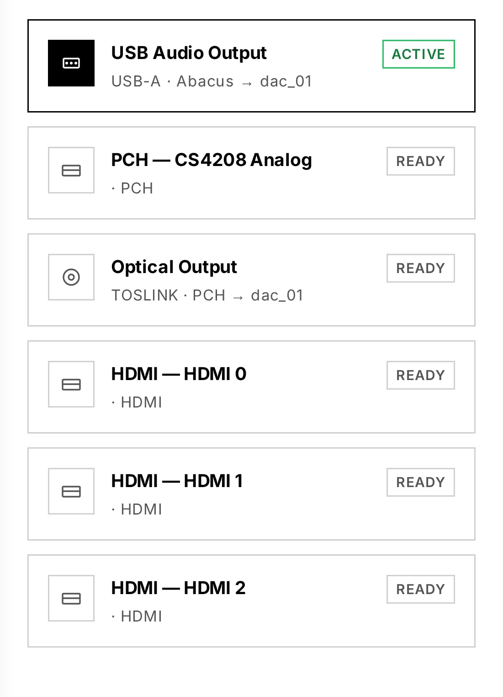
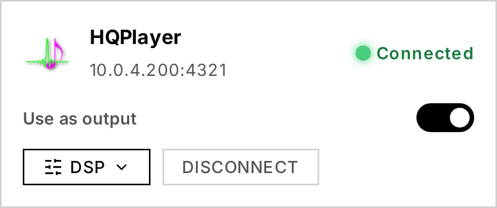

# 6. Outputs & engines

Audiogravi<sup>ty</sup> can send the same music to very different destinations — a locally
attached DAC, a network renderer across the room, HQPlayer's DSP engine, or an AirPlay
receiver. The **output selector** switches between them in one tap.

## The output selector

In **Library → Outputs**, Audiogravi<sup>ty</sup> lists every physical output the box exposes
(USB, optical, HDMI…) alongside the network renderers it has discovered, and switches
the active output when you pick one. Streaming and HQPlayer connections are managed
next to it in **Library → Sources**.




Switching is designed to be seamless. **MPD's output flips gapless** — over MPD's
control socket, without restarting the player — so there is no silence, and a cast
already playing keeps going on the new output. **AirPlay** is the exception: its
receiver has to restart to change output, so the panel warns you first that it will
interrupt any AirPlay session in progress. And when a switch does not take, the panel
tells you instead of pretending it worked — it shows the reason and rolls back to the
real state.

## Local DAC

The default: audio goes straight from MPD to the DAC attached to the box (USB, HAT,
HDMI, S/PDIF), bit-perfect and with no network round-trip. This is the purest path and
the one the guided setup wires up first.

A **HAT** — a DAC board stacked on a Raspberry Pi's GPIO header — is the one case that
needs a manual step before it can be selected: Linux does not detect it on its own. See
[9. Troubleshooting → My DAC is not in the output list](09-troubleshooting.md#my-dac-is-not-in-the-output-list-raspberry-pi-hat).

## Network UPnP renderers

Audiogravi<sup>ty</sup> is a **UPnP Control Point**: it discovers every renderer on your LAN —
network amplifiers, dedicated streamers, DLNA speakers (Marantz, Linn…) — and drives
them directly from the interface. Browse a source, hit **Play**, and the stream
reaches the renderer at **full resolution, bit-perfect**, without touching the
server's own audio path.

- The output selector switches between physical DAC outputs and network renderers.
  A **left-swipe** on a renderer removes it from the known list (a renderer still on
  the network simply reappears at the next scan).
- A live **"Up next"** strip shows the track being loaded onto the renderer.
- Transport (next / prev / pause / seek / volume) is routed through the renderer that
  owns the queue.
- You can **cast your local NAS/USB library** to a network renderer too, exactly like
  a streaming service.

> **A speaker that does not answer stops the play.** If the renderer you selected is
> asleep, off the network or still reconnecting, Audiogravi<sup>ty</sup> refuses the play and
> says so, rather than quietly sending the music out of the local DAC — the wrong
> room, with no explanation. Wake the speaker up, or pick another output.

> **Your box's own renderer.** Audiogravi<sup>ty</sup> advertises itself on the network (via
> upmpdcli) so other apps can cast *to* it. That self-entry appears in the renderer
> list as a non-selectable *"This device · receives external casts"* row — because
> playing on the box is what the **Local DAC** output already does.

## The signal path, and the chain you describe

The **Pipeline** tab draws the route your music takes, device by device: the box, the
converter, the amplifier, the speakers, and the cables between them. Audiogravi<sup>ty</sup>
detects everything that happens **inside** the box on its own — the services, the formats,
the outputs your hardware exposes. What it cannot detect is what sits *after* the box: no
machine can know that the optical cable goes to a Cambridge amplifier and then to a pair
of Harbeths.

That part is a description you write once, and Audiogravi<sup>ty</sup> **never rewrites it**.
A new box arrives with an example chain — a box, a converter over USB and optical, an
amplifier, speakers — meant to be replaced by yours. Open **Pipeline → CONFIG** to do it,
on a computer or on a phone. It is a text file, so a computer is the comfortable place to
write one from scratch; the phone is there so a box that shows nothing is never a dead
end, and for the one line you came to fix.

> **Until it describes your gear, the signal path can look empty.** The view draws a
> device only when audio is actually flowing through one of its declared connections, and
> the example chain declares USB and optical. A box playing through a **HAT board** — a
> converter mounted directly on a Raspberry Pi's connector — matches neither, so nothing
> lights up. The Pipeline tab says so, and names the output it found next to what your
> description declares: that is your cue to describe the real chain. See
> [9. Troubleshooting → The signal path is empty](09-troubleshooting.md#the-signal-path-is-empty).

## HQPlayer

If you run **HQPlayer** on your network, Audiogravi<sup>ty</sup> integrates with it three ways:

- **DSP remote** — change the interpolation **filter**, **noise shaper**, output
  **mode** and **volume** on your HQPlayer instance from the interface. It's
  auto-discovered on the LAN — connect in one tap.
- **NAA endpoint** — the box can run HQPlayer's Network Audio Adapter so HQPlayer
  streams to it and out to your DAC.
- **As your output** — the **Use as output** switch on the HQPlayer card sends your
  library through HQPlayer's DSP engine instead of straight to the local DAC.

### Use as output



With the switch on, playing an album routes it to HQPlayer, which processes it and
sends it back to your DAC through the NAA. The player badges the track with where the
music actually comes from — **Library** — and the signal path shows the full chain:
*Library → HQPlayer → NAA → your DAC*. HQPlayer is a **processor** in that chain, not
the source of the music.

The setting lives **on the box, not in your browser**: turn it on from your phone and
your laptop shows it on too. Turning it off releases the sound card so local playback
works again immediately.

**Playback starts without making you wait.** A heavy processing chain can take half a
minute to produce its first note — upsampling a DSD album, for instance — so
Audiogravi<sup>ty</sup> does not hold your tap while it checks. It watches in the background,
and if no sound actually comes out it tells you under the output, a few seconds
later. A track that plays normally shows nothing: silence there means it worked.

Audiogravi<sup>ty</sup> refuses to turn the switch on when nothing would come out — no HQPlayer
configured, or its NAA not running on the box — and tells you which of the two is
missing rather than sending your music into silence.

**What the player shows while HQPlayer is your output.** The progress bar works: it knows
how long the track is, it advances, and you can drag it to move around inside the track —
HQPlayer is asked to jump, exactly as your local output would be. This holds track by
track through an album.

The title, the artist and the cover follow the track too, all the way through an album.
That is worth a word on how it is done, because HQPlayer cannot be asked: it reads no tags
from a stream it fetches over the network, whatever the file. So Audiogravi<sup>ty</sup>
remembers the list it sent and reads which entry HQPlayer is on — the answer comes from
its own side, not from asking.

Two consequences follow from that, and they are both visible.

A playback you started from **HQPlayer's own remote** rather than from
Audiogravi<sup>ty</sup> shows no title at all — there is no list on this side to read from,
and HQPlayer's remote-control connection carries the format and the position, never the
identity of the track. You get "processor active" and the format, which is what is
actually knowable.

The same happens if you **change HQPlayer's playlist from HQPlayer itself** while
Audiogravi<sup>ty</sup> is playing to it: it notices the list is no longer the one it sent
and stops labelling rather than putting your album's titles on someone else's tracks.

**Internet radio is the exception.** A station announces the track it is playing inside the
audio stream itself, and here it is HQPlayer that receives the stream, not
Audiogravi<sup>ty</sup> — and HQPlayer keeps only the station's name, never the current
track. So a radio played through HQPlayer shows the station and its logo, where the same
station on your local output shows the song. This one is a genuine gap, not a design.

### What can and cannot go through HQPlayer

Only one question decides it now: **what format the track is in**. Where it comes from no
longer matters — every source Audiogravi<sup>ty</sup> can play reaches HQPlayer.

**Which sources reach HQPlayer:**

| Source | Through HQPlayer |
|---|---|
| Your local library | **Yes** |
| Internet radio | **Yes** |
| A UPnP media server (MinimServer, Plex…) | **Yes** |
| Qobuz, Tidal, HIGHRESAUDIO | **Yes** |
| Roon | Not applicable — a Roon zone is its own output chain |

They all get there the same way: Audiogravi<sup>ty</sup> hands HQPlayer a web address on
your own network and HQPlayer fetches the music itself. For **Qobuz** and **HIGHRESAUDIO**
that address redirects straight to the service's servers, so your box hands over an address
and steps aside — it never carries the music. **Tidal** is the one exception: it delivers
its audio in a form that has to be converted first, so that stream does pass through the
box. Nothing is re-encoded either way; the audio is bit-for-bit what the service sent.

> **Tidal and quality.** Tidal's lossy qualities (HIGH, LOW) deliver AAC, which cannot be
> converted losslessly and so plays on **no** output at all — not just through HQPlayer.
> Keep Tidal on a lossless quality. Audiogravi<sup>ty</sup> checks what Tidal actually
> serves before starting an album, and says so rather than leaving you with silence: an
> album unavailable in lossless is refused by name, even when your quality setting is right.

**Which formats HQPlayer decodes:**

HQPlayer plays **FLAC, WAV, AIFF, WavPack, MP3, DSF and uncompressed DFF**. It
**cannot decode** anything else — AAC, ALAC, M4A/MP4, OGG/Opus, APE, WMA, AC3/E-AC3,
DTS, Musepack, TAK, TTA, Shorten, Speex, AMR, MKA/WebM, AIFC, nor DST, the compressed
flavour of DFF.

The two you are most likely to meet are **AAC** — most internet radio, and Tidal's
lossy qualities — and **ALAC / M4A / MP4**, an Apple-encoded library.

Whenever a track is in one of those formats — an ALAC album in your library, an AAC
track on your media server, a station broadcasting in AAC — Audiogravi<sup>ty</sup> tells you
straight away rather than letting playback fail obscurely, and names the format.

> **The same file can be named two ways.** M4A and MP4 are one container under two
> names, and media servers disagree: MinimServer publishes a track as `.m4a`, Plex
> publishes the very same file as `.mp4`. Both are refused, and the message names
> whichever spelling your server used — it is one format, not two problems.
Turn the switch off to play it on the local output. An album is checked before
anything is sent, so a single unplayable track is caught up front instead of
stopping the music halfway through.

This matters most for **internet radio**, where many Hi-Res stations broadcast in AAC —
a station can therefore be refused on format even though radio is a source HQPlayer
otherwise accepts.

> **One output at a time.** HQPlayer and a network renderer cannot both be your
> output. If both are selected, Audiogravi<sup>ty</sup> asks you to turn one off instead of
> guessing which device you meant.

## Roon

Audiogravi<sup>ty</sup> works with a **Roon Bridge** endpoint and connects to your remote **Roon
Core** for metadata and transport — so a Roon zone can sit alongside your other
outputs in the same interface.

**Setting it up.** Nothing to configure on the box, and no file to edit:

1. **Install Roon Bridge** from the **Audio Software** page, and leave it running. That is
   what tells Audiogravi<sup>ty</sup> that Roon belongs on this box — it then looks for your
   Core on the network by itself. You do not need to know your Core's address, and its port
   is fixed by Roon, so there is nothing to set for either.

2. **Authorize the extension in Roon.** Open Roon (the desktop or mobile app connected to
   your Core) → **Settings → Extensions**. An extension named **“Audiogravity”** appears
   in the list — click **Enable** next to it. That's the one-time authorization, and the
   only thing that grants Audiogravi<sup>ty</sup> any access: Roon hands it a token, the box
   stores it, and it reconnects on its own afterwards (no need to re-authorize on restarts).

> Until you click **Enable** in Roon (step 2), the connection stays unauthorized and Roon
> data won't appear. **The Roon card in Library → Sources says where you are**: whether
> Roon Bridge is running here, whether a Core is answering, whether the extension is still
> waiting for you — with the name to look for — or how many zones are connected. Once you
> have clicked Enable, *I have enabled it* on the card checks again straight away.

**If the Core cannot be found.** On a network where the search cannot reach it — a Core on
another segment, or a router that blocks the broadcast — name it in
`/opt/audiogravity/core/.env` and restart the core:

```
ROON_CORE_HOST=192.168.1.50    # the IP of the machine running Roon Core
```

An address that answers is used straight away; one that does not is not a dead end, the
search still runs.

## AirPlay

The box can act as an **AirPlay receiver** (shairport-sync) — stream to it from an
iPhone, iPad or Mac, and it plays through the same output chain, with the same
now-playing readout.

## Seeing the whole chain

The **Audio Pipeline** view (Pro) draws your entire signal chain as a live graph —
controller → server → streamer → converter/amp → output. Animated particles mean audio
is flowing; **green links** mean lossless, no sample-rate conversion (bit-perfect); a
**bit-perfect** badge confirms it. On small screens it falls back to a simplified Now
Playing view with per-stream output steering (USB / Optical).

The graph is drawn from a map you own, **`audio-topology.json`** — see
[7. Administration → Audio topology](07-administration.md#audio-topology-signal-chain-map)
to edit it, and the same section for the tuning that keeps this path clean.
