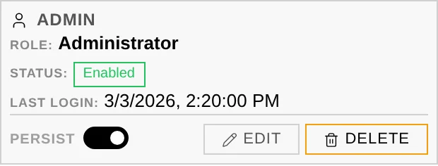
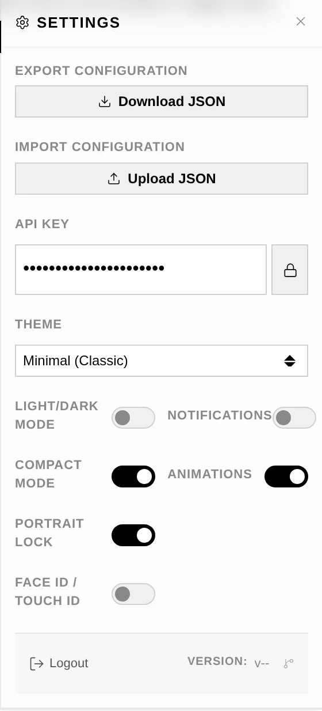
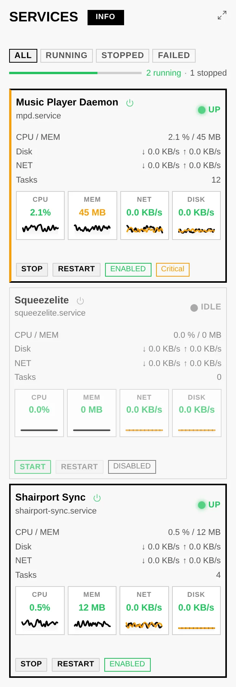
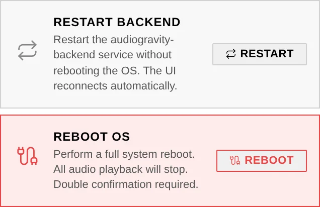

# 7. Administration

Everything you need to run the box lives in the interface — no SSH required. Most of
this section is **Pro**; a few tabs (Profiles, Services, Audio Software, System,
Admin) are available on **Starter** too. Every tab has an **INFO** badge that opens
an in-app explanation.

## The Admin tab

The **Admin** tab gathers everything about accounts and the box's relationship with
Audiogravi<sup>ty</sup>: the **user cards** (below), unread
[announcements](#announcements), the [update banner](08-updating.md) — and the
**licence** panel, which also opens when a Starter install taps a locked Pro tab.

## Users & access

User management lives on the **Admin** tab — one card per account, with an online
indicator for users currently connected. Three roles control who can do what:



- **Admin** — full access to all features and user management. Cannot be deleted or
  demoted by others, and cannot delete their own account.
- **User** — standard access to features, but cannot manage users or core settings.
- **Guest** — read-only: can view status and logs but not change settings or toggle
  services.

**Passkeys** — the *Passkeys* button on your own card registers WebAuthn credentials
(Face ID, Touch ID, a hardware key). Each passkey is tied to one device and can be
removed individually; use it instead of a password at login. Password changes take
effect immediately on current sessions.

**Session persistence** — the *Persist* toggle chooses how your session is stored:
persistent (stay logged in across browser restarts) or session-only (log out when
the tab closes). Takes effect on your next login.

## The Settings panel

The **gear** in the top bar opens the app-wide Settings panel:

- **Export / Import Configuration** — download or replace `audio-config.json`, the
  services-and-profiles registry (see *Audio configuration* below).
- **API Key** — the key this interface uses to talk to the core. It is set for you at
  install time; the field (with a reveal button) is here for advanced setups.
- **Theme** — three looks: *Minimal (Classic)*, *Slate (Modern)* and *Gravity (Bold &
  Cosmic)* — plus a **Light/Dark Mode** toggle.
- **Notifications** — subscribe this device to **push notifications** (see below).
- **Compact Mode** — a denser layout. **Animations** — turns UI motion off
  (functional loading spinners keep animating so an operation never looks stuck).
- **Portrait Lock** — phones and tablets only; see
  [4. Listening](04-listening.md#portrait-lock).
- **Face ID / Touch ID** — register this device as a **passkey** in one tap; each
  registered device appears as a chip you can remove individually. (These are the
  same credentials as the *Passkeys* button on your user card above.)



### Push notifications

With **Notifications** on, the box sends this device a system notification when
something needs attention — even with the app closed:

- a monitored **service goes down**;
- the **CPU reaches a critical temperature**;
- a **software package update** is available;
- a **profile** is activated.

Like passkeys, push needs Audiogravi<sup>ty</sup> reachable over a real HTTPS **domain** —
it does not work over a bare IP (see [2. Installation](02-installation.md)).

## Services

Monitor and control individual systemd services in real time.

- **Status** — active (green), inactive (grey) or failed (red); the dot blinks orange
  while a start/stop is pending. A segmented **health bar** shows the running / stopped
  / failed proportions at a glance.
- **Control** — start, stop or restart any service from its tile. The **ENABLED /
  DISABLED** badge controls whether it starts at boot. Uptime is shown next to the
  unit name.
- **Detail** — click a service name for live metrics (CPU, memory, tasks, network,
  disk) and the session action history. Metrics are colour-coded LOW / MEDIUM / HIGH,
  tuned per audio service (e.g. CPU: ≤5 % low, 5–20 % medium, >20 % high).
- **Filter** — ALL / RUNNING / STOPPED / FAILED.



## Config editor

Safely edit the real configuration files of your audio services (see also
[3. First run](03-first-run.md) for the guided setup).

- **Guided mode** (MPD / AirPlay / UPnP) — change output or library in a couple of
  clicks; only the changed setting is rewritten. *Reset to default* regenerates a
  minimal config (current file backed up first).
- **Form mode** — edit common settings through a friendly interface with field
  descriptions and validation.
- **Expert (Raw) mode** — edit the raw file directly, with syntax validation before
  save.
- **Preview changes (Diff)** — a unified diff (raw) or a before/after field table
  (form) of your unsaved edits.
- **Automatic backups** — every save creates a timestamped backup; the **Backups**
  button browses and restores any previous version.
- **Restart after save** — on by default (applies changes immediately); uncheck to
  batch several edits.

## Audio configuration (services & profiles)

`audio-config.json` is the registry of the audio **services** Audiogravi<sup>ty</sup> manages and
the **profiles** built on top of them. It's what populates the **Services** tab (each declared
service becomes a controllable tile) and the **Profiles** tab (each profile a one-tap way to
start one set of services and stop another). It is a different file from the per-service config
files edited above — this one lists *which* services exist, not their internal settings.

- **Services** — each entry declares a `label`, its `systemd_unit` (e.g. `mpd.service`), the
  path of its own config file (`appconfigfile` — the file the *Config editor* above edits) and
  a `critical` flag. MPD, upmpdcli (UPnP), shairport-sync (AirPlay), Roon Bridge and HQPlayer's
  NAA are the usual entries.
- **Profiles** — each entry has a `name`, a `description`, and two lists: the services to
  **start** and the services to **stop** when you activate it (plus an optional `critical` flag
  and `depends_on`). "MPD", "Stop All"… are profiles.
- **`topology_link`** — ties this box to its device in the topology (`host_device_id`, e.g.
  `streamer_01`), so the signal-chain view knows which streamer the services run on.

- **Managing it.** Open **Settings** (the gear in the top bar). *Export Configuration*
  downloads the current `audio-config.json`; *Import Configuration* uploads a replacement.
- **Validation on import.** An imported file is checked before it is applied: bad structure, a
  missing required field, a wrong type — but also a `systemd_unit` that isn't installed on the
  box or an `appconfigfile` that doesn't exist — are reported as blocking **errors**; softer
  issues appear as **warnings** you can review and accept. A reference
  **`audio-config.json.example`** ships with the box.

See also **Audio topology** below — the *other* file you own, describing the physical hi-fi
chain that feeds the signal-path view.

## Audio topology (signal-chain map)

The **Audio Pipeline** graph (see [6. Outputs & engines](06-outputs-engines.md)) is drawn
from a single file you own: **`audio-topology.json`**. It is a plain description of your
hi-fi chain — which devices you have (streamer, DAC, amplifier, speakers, the app driving
it…) and how they are wired together. Audiogravi<sup>ty</sup> **reads** it to draw the picture;
it **never rewrites** it, so the map always reflects exactly what you declared.

- **What it declares vs. what is detected.** The topology describes the *chain* — the boxes
  downstream of your streamer and how they connect. The streamer's own **physical outputs**
  (USB, optical, HDMI…) are resolved **live from the real hardware** at playback time, not
  from the file; the file just tells Audiogravi<sup>ty</sup> which cable feeds which device so the
  graph and the output labels line up.
- **Editing it.** Open the **Audio Pipeline** view and click **CONFIG** (Pro, admin/user —
  guests get a read-only view). The editor opens in **View mode**; hit **Edit** to unlock the
  JSON, then **Save**.
- **Download / Upload.** From the same editor, **Download** saves the current
  `audio-topology.json` to your computer — handy for editing it offline or keeping a copy;
  **Upload** loads a file back into the editor for review, and the usual save-time validation
  runs when you click **Save** (nothing is written until you do).
- **Validation on save.** Before the file is written, Audiogravi<sup>ty</sup> checks it:
  a malformed file or an unknown device type is an **error** and blocks the save; a broken
  link (an output pointing at a device that doesn't exist) or a connector that maps to no real
  output is a **warning** you can review and accept. Once saved, the graph reloads immediately.

### Structure

Everything lives under `hifi_topology.devices` — a map keyed by a device id you choose:

```json
{
  "hifi_topology": {
    "devices": {
      "streamer_01": {
        "type": "streamer",
        "label": "Audiogravity",
        "outputs": {
          "usb_out": { "connector": "usb-a", "target_device_id": "dac_01" }
        }
      },
      "dac_01": {
        "type": "converter",
        "label": "My DAC",
        "inputs":  { "usb_in": { "connector": "usb-b" } },
        "outputs": { "line_out": { "connector": "rca", "target_device_id": "amp_01" } }
      }
    }
  }
}
```

- **`type`** — one of `streamer`, `converter` (DAC), `amplifier`, `output` (speakers),
  `source`, `server`, `storage`, `controller`.
- **`outputs` / `network_outputs`** — each wired output points at a `target_device_id`
  (and optionally a `target_input_id` on that device); that's what links the chain together.
- **`connector`** — on the **streamer**, the output connector (`usb-a`, `toslink`, `hdmi`,
  `rca`/`jack`…) is what maps the declared output onto a **detected** hardware output. A
  connector that matches no real output is what the save-time check warns about.

A fully-commented reference file, **`audio-topology.json.example`**, ships with the box and
validates cleanly — start from it when in doubt (Download the current file, edit against the
example, then Upload it back).

### Keeping it up to date

Edit the map whenever your physical setup changes — a new DAC, a different amplifier, a cable
moved from optical to USB. Keep the `target_device_id` values consistent (an output should
point at a device id that exists), and the save-time validation will flag typos before they
reach the graph. Every save is backed up automatically, so you can always roll back.

## Audio Software

Install, update and uninstall the services Audiogravi<sup>ty</sup> uses (MPD, upmpdcli,
shairport-sync, Roon Bridge…).

- **States** — NOT INSTALLED, INSTALLED, INSTALLING/UPDATING (progress bar), ERROR.
- **Actions** — INSTALL, UPDATE (to the latest version), UNINSTALL.
- **Version check** — per-card or **CHECK UPDATES** in the header to refresh all. When
  updates are pending, an **UPDATE ALL** badge appears next to it to run them in one go.
- **Restart required** — a pulsing badge appears when a service needs a restart after
  install/update; click to restart it.
- **Architecture** — the CPU badge shows supported architectures (amd64, arm64…);
  unsupported cards are dimmed. A **DRY-RUN** mode simulates operations safely.

## System

Real-time monitoring and box-level actions.

- **Metrics** — CPU, temperature, memory, disk and network, updated every few seconds
  over SSE (the **LIVE** badge shows the stream is active).
- **System & audio hardware** — hostname, OS, kernel, CPU model/cores; every audio
  card, USB interface and subdevice.
- **Event log** — system events and SSE messages; RUNNING/STOPPED to pause, CLEAR to
  reset.
- **Actions (admin)** — *Restart Backend* restarts the Audiogravi<sup>ty</sup> service without
  rebooting; *Reboot OS* performs a full reboot (double confirmation). The UI
  reconnects automatically.


- **Terminal (admin)** — a full interactive bash shell in the browser (runs as the
  backend user — use with care).

## Performance tuning (Pro)

Tune CPU scheduling for bit-perfect, glitch-free playback.

- **CPU governor** — *performance* (max frequency always, lowest latency),
  *schedutil* (adapts to load), *powersave* (not recommended for audio). *Apply All*
  sets it on every core; *Save Conf* persists it; *Create Service* restores it at boot.
- **THROTTLED badge** — appears on a core when the kernel reports thermal throttling;
  sustained throttling during playback causes glitches.
- **Latency test** — runs `cyclictest` to measure real-time scheduling latency (µs);
  lower max = fewer dropouts. History of the last 10 runs.
- **Network test** — ping jitter/loss or iperf3 throughput; useful for Roon, AirPlay
  or NAS playback.
- **RT process monitor** — shows the scheduling policy of audio processes: SCHED_FIFO
  / SCHED_RR = real-time (green); NON-RT = risk of glitches under load (red).

## Systemd tuning (Pro)

Low-level, per-service OS tuning using systemd **drop-in overrides** — the native
`.service` files are **never modified**; everything lives in an isolated
`.d/override.conf`.

- **CPU affinity** — pin a service to specific cores to cut context-switching jitter.
- **RT scheduling** — FIFO/RR policy and priority (1–99) for guaranteed CPU time.
- **CPU weight / I/O priority / OOM score** — bias the scheduler, disk/network I/O and
  the out-of-memory killer in favour of audio.
- **RT preset** — *Audio Optimized* pre-fills a battle-tested config (SCHED_FIFO 80,
  LimitRTPRIO 99, MEMLOCK infinity, I/O realtime, OOMScoreAdjust −500, CPUWeight 1000).
- **Safety** — a diff preview before applying, automatic backups (*Restore Backup*),
  and *Remove Override* to roll a service back to factory behaviour instantly.

## Announcements

From time to time Audiogravi<sup>ty</sup> broadcasts a short announcement — early-access
news, an important notice. Unread announcements appear as **dismissible banners** at
the top of the **Admin** page, and the Admin tab carries a small marker until you have
seen them (the same cue it uses for a [waiting update](08-updating.md)). Dismissals
are remembered per device.

## Licence

The licence panel opens from the **Admin** tab (and automatically when a **Starter**
install taps a Pro tab — those carry a small lock icon in the tab bar).

- **Trial** — 30 days of full access, auto-activated on first run.
- **Lifetime** — a single-device `.lic` file cryptographically tied to this device's
  hardware fingerprint (the **Device ID**). One-time payment, no expiry, no
  subscription.
- **Import / re-download** — import a `.lic` file, or re-download yours from the
  self-service portal (purchase email + Device ID, no account needed) after an OS
  reinstall.

## Related

- [8. Updating](08-updating.md) — keeping the box current
- [9. Troubleshooting](09-troubleshooting.md) — when something misbehaves
