# 7. Administration

Everything you need to run the box lives in the interface — no SSH required. Most of
this section is available on **Starter**: Profiles, Services, Audio Software, System,
Admin — and **Config**, the configuration editor and its guided setup. Four tabs are
**Pro**: Systemd tuning, Performance tuning, the Audio Pipeline map and the Library.

## The Admin tab

The **Admin** tab gathers everything about accounts and the box's relationship with
Audiogravi<sup>ty</sup>: the **user cards** (below), unread
[announcements](#announcements), the [update banner](08-updating.md) — and the
**licence** panel, which also opens when a Starter install taps a locked Pro tab.

At the bottom of the tab, the **Frontend performance cockpit** measures the app itself in
your browser: the live updates it receives, its timers, the memory it uses (in Chrome, Edge
and other Chromium browsers) and how long the page has been open. It is a diagnostic aid —
nothing there changes how the box plays.

## Users & access

User management lives on the **Admin** tab — one card per account, with an online
indicator for users currently connected. Three roles control who can do what:

- **Admin** — full access, including user management. The **admin** account created at
  installation cannot be deleted, disabled or demoted; any other admin account can be, by
  another admin. Nobody can delete, disable or change the role of their own account.
- **User** — everything except what is kept for admins: managing accounts, the guided
  setup of the audio stack and its network shares, the Config editor's **Guided** mode
  and **CONFIGURED** badges, the **DRY-RUN** switch of Audio Software, restarting or
  rebooting the box, updating Audiogravi<sup>ty</sup>, the support report, the terminal
  and removing the licence. The **Admin** tab is not shown to users.
- **Guest** — can look at every tab except **Admin** and control what is playing — play
  and pause, skip, seek, volume, repeat, shuffle and the sleep timer, on the box, a
  network speaker or HQPlayer — but not start something else, send it to another output,
  change settings, start or stop services, or read the logs.

Changing an account's password or role, disabling it or deleting it signs that account
out on every device where it is open. When you change your own password, you stay signed
in on the device you changed it from.

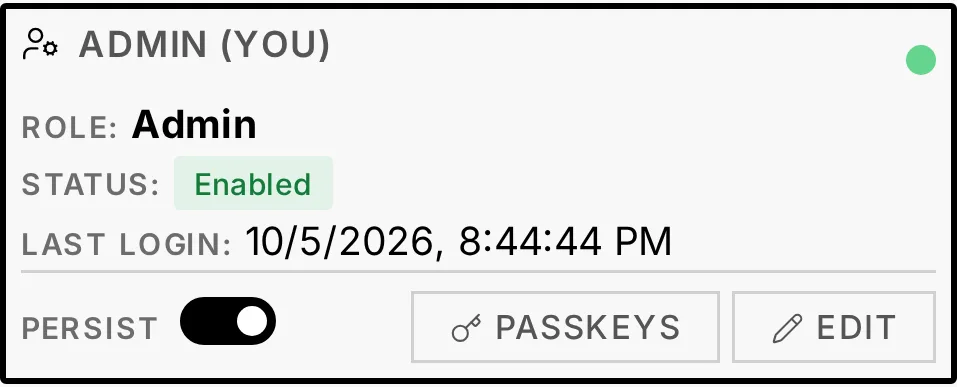

**Passkeys** — the *Passkeys* button on your own card registers WebAuthn credentials
(Face ID, Touch ID, a hardware key). Each passkey is tied to one device and can be
removed individually; use it instead of a password at login.

**Session persistence** — the *Persist* switch on each card decides whether that
account stays signed in when its browser is closed and reopened, or is signed out when
the tab closes. It applies from the account's next sign-in. Either way a session lasts
12 hours; the app installed on a phone's home screen always keeps its session when it is
closed, for the same 12 hours.

## The Settings panel

The **gear** in the top bar opens the app-wide Settings panel:

- **Theme** — three looks: *Minimal (Classic)*, *Slate (Modern)* and *Gravity (Bold &
  Cosmic)* — plus a **Light/Dark Mode** toggle. The light/dark switch is also on the
  sign-in screen, so the choice can be made before signing in (see
  [3. First run](03-first-run.md#2-sign-in--and-secure-your-account)); the look itself is
  chosen here.
- **Notifications** — subscribe this device to **push notifications** (see below).
- **Animations** — turns UI motion off (functional loading spinners keep animating so
  an operation never looks stuck).
- **Portrait Lock** — phones and tablets only; see
  [4. Listening](04-listening.md#portrait-lock).
- **Face ID / Touch ID** — register this device as a **passkey** in one tap; each
  registered device appears as a chip you can remove individually. (These are the
  same credentials as the *Passkeys* button on your user card above.)

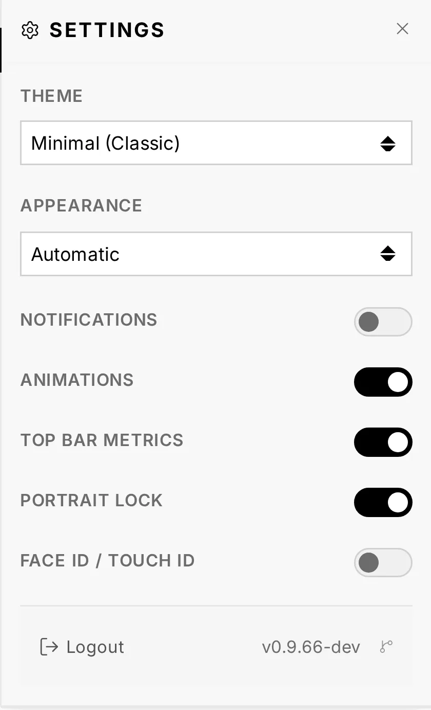

### Push notifications

With **Notifications** on, the box sends this device a system notification when
something needs attention — even with the app closed:

- a monitored **service goes down**;
- the **CPU reaches a critical temperature**;
- a **software package update** is available;
- a **profile** is activated.

Like passkeys, push needs Audiogravi<sup>ty</sup> reachable over a real HTTPS **domain** —
it does not work over a bare IP (see [2. Installation](02-installation.md)).

## Services

Monitor and control individual systemd services in real time.

- **Status** — active (green), inactive (grey) or failed (red); the dot blinks orange
  while a start/stop is pending. A segmented **health bar** shows the running / stopped
  / failed proportions at a glance.
- **Control** — start, stop or restart any service from its tile. The **ENABLED /
  DISABLED** badge controls whether it starts at boot. Uptime is shown next to the
  unit name.
- **Detail** — click a service name for live metrics (CPU, memory, tasks, network,
  disk) and the last actions made on it from this browser. Metrics are colour-coded
  LOW / MEDIUM / HIGH, tuned per audio service (e.g. CPU: ≤5 % low, 5–20 % medium,
  >20 % high).
- **Graphs** — each figure on a tile has a small graph of its recent values; click the
  graph to unfold a larger chart on the tile, and **×** to fold it away. Network and
  disk draw two lines: received and sent, read and written.
- **Filter** — ALL / RUNNING / STOPPED / FAILED.

> **A dash means "not measured", not "zero".** Three of the figures depend on counters
> that can be switched off, and Audiogravi<sup>ty</sup> shows a dash rather than inventing a
> value:
>
> - **Disk** and **Network** are counted per service, and only when **IO Accounting** and
>   **IP Accounting** are enabled on that service — two switches in the **Systemd** tab's
>   override editor. They take effect at once, without a reboot.
> - **Memory** depends on the machine: a Raspberry Pi kernel starts with its memory counter
>   switched off, and no setting in the app can change that. See
>   [9. Troubleshooting → Memory shows a dash for every service](09-troubleshooting.md#memory-shows-a-dash-for-every-service).
>
> CPU and tasks are always measured.

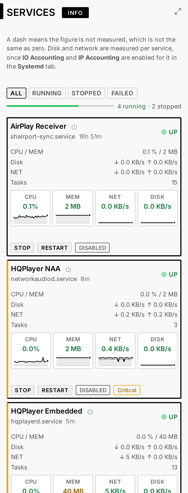

## Config editor

Safely edit the real configuration files of your audio services (see also
[3. First run](03-first-run.md) for the guided setup).

- **Guided mode** (admins; MPD, AirPlay, UPnP, HQPlayer Embedded) — choose the output,
  and for MPD the music library, in a couple of clicks; only the changed setting is
  rewritten. UPnP has nothing to choose there, because it plays through MPD. *Reset to
  default* regenerates a minimal config (current file backed up first) — except for
  HQPlayer Embedded, whose settings are its own: only its output is chosen here.
- **Form mode** (called *Structured* next to *Guided*) — edit common settings through a
  friendly interface, with a description for each field. HQPlayer Embedded has none: its
  file is edited in Expert mode.
- **Expert (Raw) mode** — edit the raw file directly. A basic check before saving
  catches a broken structure (an unclosed section or tag), not a wrong value.
- **Preview changes (Diff)** — a unified diff (raw) or a before/after field table
  (form) of your unsaved edits.
- **Automatic backups** — every save, and every restore, first backs up the current
  file; the **Backups** button lists the last 10 and restores any of them.
- **Restart after save** — on by default (applies changes immediately); uncheck to
  batch several edits.

Each tile carries the state of its service — **RUNNING**, **STOPPED** or **FAILED** —
and, for admins, whether a service Audiogravi<sup>ty</sup> can set up itself is
**CONFIGURED** or still on its package defaults. HQPlayer Embedded is **CONFIGURED** once
its output has been chosen here.

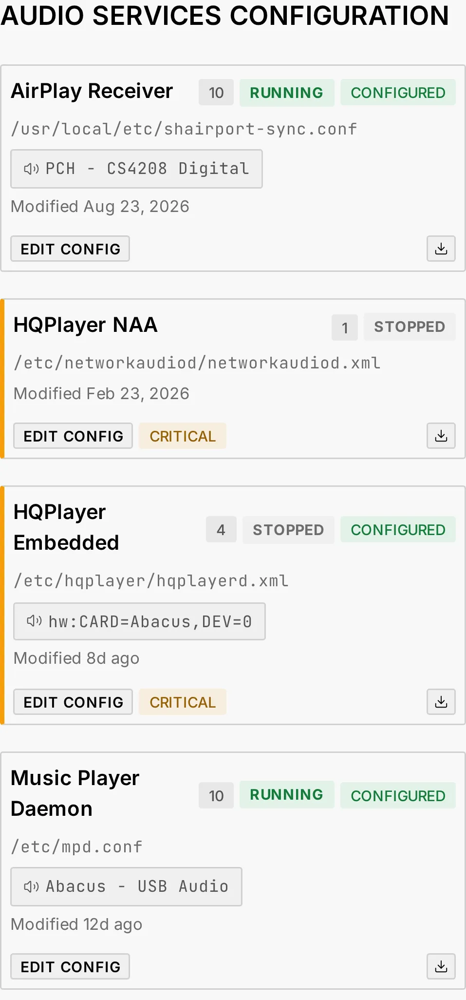

### When the software behind a tile is not installed

A tile whose package is absent is dashed and greyed, carries an **UNAVAILABLE** badge
and says so in plain words, with a link to [Audio Software](#audio-software) where the
package is installed.

A package removed without purging leaves its configuration file behind, and that file
stays **downloadable**. **Editing is closed**, because saving a configuration also
restarts the service and no restart can succeed for software that is not there. Your
backups are not lost; they come back with the package.

An installed service whose file is missing keeps its editor, which is what creates the
file.

## Audio configuration (services & profiles)

The **Services** tab and the **Profiles** tab both come from one file,
`/etc/audiogravity/audio-config.json`: the audio **services** Audiogravi<sup>ty</sup> drives, and
the **profiles** built on them — each a one-tap way to start one set of services and stop
another. It is a different file from the per-service config files edited above: this one lists
*which* services exist, not their settings.

Audiogravi<sup>ty</sup> ships this file, and puts it in place at every installation and every
update: the services and profiles on your box are those of the version you run.

- **A profile's name says what it starts** — *MPD + HQPlayer NAA* runs MPD and HQPlayer's NAA —
  and its description what it is for. Two exceptions: *UPnP Renderer* runs MPD and the UPnP
  bridge, and *Stop All* stops everything.
- **A profile that starts HQPlayer's NAA or HQPlayer Embedded is critical**: its tile has an
  orange left edge, and the confirmation of a switch is titled *Critical Profile*.
- **The services and profiles of software you have not installed stay listed**, greyed out,
  until you install it from [Audio Software](#audio-software).

A change made to the file by hand lasts until the installer runs again — at the next update,
or a reinstall — which puts the shipped file back and keeps the one it replaces beside it as
`audio-config.json.previous`. To make one, see
[9. Troubleshooting → Changing the profiles between two versions](09-troubleshooting.md#changing-the-profiles-between-two-versions).

See also **Audio topology** below — the file you own, describing the physical hi-fi chain that
feeds the signal-path view.

## Audio topology (signal-chain map)

The **Audio Pipeline** graph (see [6. Outputs & engines](06-outputs-engines.md)) is drawn
from a single file you own: **`audio-topology.json`**. It is a plain description of your
hi-fi chain — which devices you have (streamer, DAC, amplifier, speakers, the app driving
it…) and how they are wired together. Audiogravi<sup>ty</sup> **reads** it to draw the picture;
it **never rewrites** it, so the map always reflects exactly what you declared.

- **What it declares vs. what is detected.** The topology describes the *chain* — the boxes
  downstream of your streamer and how they connect. The streamer's own **physical outputs**
  (USB, optical, HDMI…) are resolved **live from the real hardware** at playback time, not
  from the file; the file just tells Audiogravi<sup>ty</sup> which cable feeds which device so the
  graph and the output labels line up.
- **Editing it.** Open the **Audio Pipeline** view and click **CONFIG** (Pro, admin/user —
  guests get a read-only view). The editor opens in **View mode**; hit **Edit** to unlock the
  JSON, then **Save**.
- **Download / Upload.** From the same editor, **Download** saves the current
  `audio-topology.json` to your computer — handy for editing it offline or keeping a copy;
  **Upload** loads a file back into the editor for review, and the usual save-time validation
  runs when you click **Save** (nothing is written until you do).
- **Validation on save.** Before the file is written, Audiogravi<sup>ty</sup> checks it:
  a malformed file or an unknown device type is an **error** and blocks the save; a broken
  link (an output pointing at a device that doesn't exist) or a connector that maps to no real
  output is a **warning** you can review and accept. Once saved, the graph reloads immediately.

### Structure

Everything lives under `hifi_topology.devices` — a map keyed by a device id you choose:

```json
{
  "hifi_topology": {
    "devices": {
      "streamer_01": {
        "type": "streamer",
        "label": "Audiogravity",
        "outputs": {
          "usb_out": { "connector": "usb-a", "target_device_id": "dac_01" }
        }
      },
      "dac_01": {
        "type": "converter",
        "label": "My DAC",
        "inputs":  { "usb_in": { "connector": "usb-b" } },
        "outputs": { "line_out": { "connector": "rca", "target_device_id": "amp_01" } }
      }
    }
  }
}
```

- **`type`** — one of `streamer`, `converter` (DAC), `amplifier`, `output` (speakers),
  `source`, `server`, `storage`, `controller`.
- **`outputs` / `network_outputs`** — each wired output points at a `target_device_id`
  (and optionally a `target_input_id` on that device); that's what links the chain together.
- **`connector`** — on the **streamer**, the output connector (`usb-a`, `toslink`, `hdmi`,
  `rca`/`jack`…) is what maps the declared output onto a **detected** hardware output. A
  connector that matches no real output is what the save-time check warns about.

A fully-commented reference file, **`audio-topology.json.example`**, ships with the box and
validates cleanly — start from it when in doubt (Download the current file, edit against the
example, then Upload it back).

### Keeping it up to date

Edit the map whenever your physical setup changes — a new DAC, a different amplifier, a cable
moved from optical to USB. Keep the `target_device_id` values consistent (an output should
point at a device id that exists), and the save-time validation will flag typos before they
reach the graph. Every save is backed up automatically, so you can always roll back.

## Audio Software

Install, update and uninstall the services Audiogravi<sup>ty</sup> uses (MPD, upmpdcli,
shairport-sync, Roon Bridge…).

- **Filter** — ALL / INSTALLED / UPDATES narrows the list of cards.
- **States** — NOT INSTALLED, INSTALLED, INSTALLING / UPDATING / UNINSTALLING (with a
  progress bar), ERROR.
- **Actions** — INSTALL, UPDATE (to the version its publisher offers), UNINSTALL. After a failed
  operation the card offers the way out that fits it: an install that failed left
  nothing behind, so it offers to try again; an update that failed left the previous
  version in place, so it offers to update or to remove.
- **Before installing** — when the software comes with a licence, as HQPlayer's do, it is
  shown first, and nothing installs until you accept it. When it is published in several
  versions side by side, you choose one; a version your box cannot run is listed with the
  reason.
- **Uninstalling keeps your settings** — reinstall, and they are back. To erase them as
  well, tick *Also delete its settings and data*; this cannot be undone. Roon's packages
  are the exception: uninstalling them removes their settings too.
- **Install Incomplete** (or *Update Incomplete*) — the software is installed, but a step
  after that could not be done: the message says what is left to do. It also names any other software the system
  removed on the way.
- **Version check** — **your box checks by itself, once a day**, and tells you when
  something new is published; you do not have to come and ask. **CHECK UPDATES** in
  the header asks immediately, and first refreshes what your system knows its software
  sources publish — which is what makes the answer current rather than as old as the
  last boot. When updates are pending, an **UPDATE ALL** badge appears next to it to
  run them in one go.
- **Roon is the exception** — Roon publishes no version number, so your box cannot tell
  you a Roon update is waiting, and never will. Use the button anyway when you want to
  move: it re-runs Roon's own installer, which always fetches the current build. The
  card tells you which build you have and that there is nothing to compare it against.
- **HQPlayer NAA follows your HQPlayer** — the adapter has to be on the same major line as
  the HQPlayer it feeds, so the version offered here is the one that matches the instance
  you are connected to, not simply the newest the vendor publishes. With no HQPlayer
  answering, the line already installed is kept.
- **HQPlayer Embedded** — installing it also gives you a password for its web page: see
  [6. Outputs & engines → HQPlayer Embedded](06-outputs-engines.md#hqplayer-embedded).
- **Not available here** — a greyed-out INSTALL always says why, and the three reasons
  are not the same: the publisher has **no build** for your machine's architecture
  (nothing to be done); their site **could not be reached** when the list was worked
  out (worth trying again — the refresh icon in the page header rebuilds it); or
  another installed package **rules it out**. Roon is the case you are most likely to
  meet: Roon Server already contains Roon Bridge, so the two cannot share a box, and
  the card names the one that is in the way.
- **Installed, but not configured** — installing a service does not configure it; that
  is a separate step. The card says so while a service still runs on the
  settings its own package shipped, because it can then play to the wrong output while
  looking perfectly ready.
- **Playback is interrupted** — updating a service restarts it, uninstalling stops it.
  The confirmation names the service that is about to be cut, so an update chosen in
  the middle of an album is a decision rather than a surprise.
- **Restart required** — a pulsing badge appears when a service needs a restart after
  install/update; click to restart it. HQPlayer Embedded is restarted for you once
  installed, so it only shows the badge when that restart failed.
- **Documentation** — the book icon at the foot of a card opens the publisher's
  documentation in a new tab.
- **Architecture** — the CPU badge lists the processor types the package is published
  for.
- **DRY-RUN** (admins) — goes through an operation without changing anything. It only
  walks the steps: a dry run that succeeds does not prove the real one will.

## System

Real-time monitoring and box-level actions.

- **Metrics** — CPU, temperature, memory, disk and network, updated live; the **SSE
  Stream** tile shows whether the live feed is connected.
- **System & audio hardware** — hostname, OS, kernel, CPU model/cores; every audio
  card, USB interface and subdevice.
- **Event log** — system events and live updates; RUNNING/STOPPED to pause, CLEAR to
  reset.
- **Actions (admin)** — *Restart Core* restarts the Audiogravi<sup>ty</sup> service without
  rebooting; *Reboot OS* performs a full reboot (double confirmation). The UI
  reconnects automatically. While software is being installed, both are refused with a
  message naming what is being installed: try again once it has finished. *Support
  Report* is described below.
- **Terminal (admin)** — a full interactive shell on the box, in the browser. It can
  change anything on the machine: use it with care. Closing it — or the end of your
  session — stops everything running in it, even a command started with `nohup`: run a
  long task over SSH instead.

### Support report

*Support Report* in **System › Actions** collects, in one gesture, everything someone
helping you would otherwise have to ask for: the version and architecture, the licence
verdict, system vitals, which audio packages are installed and at which versions, the
state of each service and whether it starts at boot, the detected outputs — each with
its full label and its `hw:` address, so two sockets on the same card can be told apart
— and, for every service, both the output Audiogravi<sup>ty</sup> pinned it to and the one its
own configuration actually names, flagged when the two disagree. That last line is the
one most worth having: a box playing out of a socket nobody chose looks exactly like a
box playing correctly, until something says so. It also carries whether each
configuration file is Audiogravi<sup>ty</sup>-managed or hand-written, whether each streaming
account is signed in, the declared music library and whether MPD has actually indexed
it — and the configuration files themselves.

It also carries what a **certificate** incident turns on: the day the served
certificate was **issued** and not only the day it expires, when the box's own
**authority** was created and its fingerprint — an upgrade never replaces that
authority, so those two tell *"the authority changed and every device stopped at
once"* apart from *"this one device was never set up"* — whether each interface's
address is **leased or fixed**, which is whether it can still move, the **name the box
announces**, asked of the announcing service itself rather than guessed from the
hostname, and the **date** of the last self-update. When the announced name is not one
the certificate carries, the report says so on the spot rather than leaving you to
compare two sections by eye.

It also gives **the address to type** to reach the interface: the box's address on your
network, and its `.local` name beside it, each with the port to use.

**Passwords, API keys and access tokens are removed before the report is built.** A
credential's *name* stays visible so you can still see the setting exists, but its value
never appears. Neither does the content of your library.

Nothing is sent anywhere. The report is displayed for you to read; **Copy** puts it on
your clipboard and **Download** saves it as a text file, so it travels only if you
attach it to a message yourself.

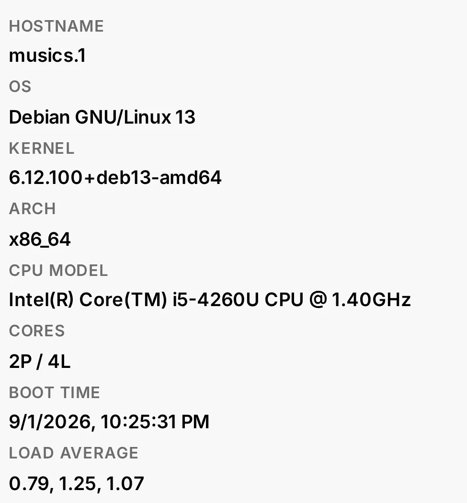

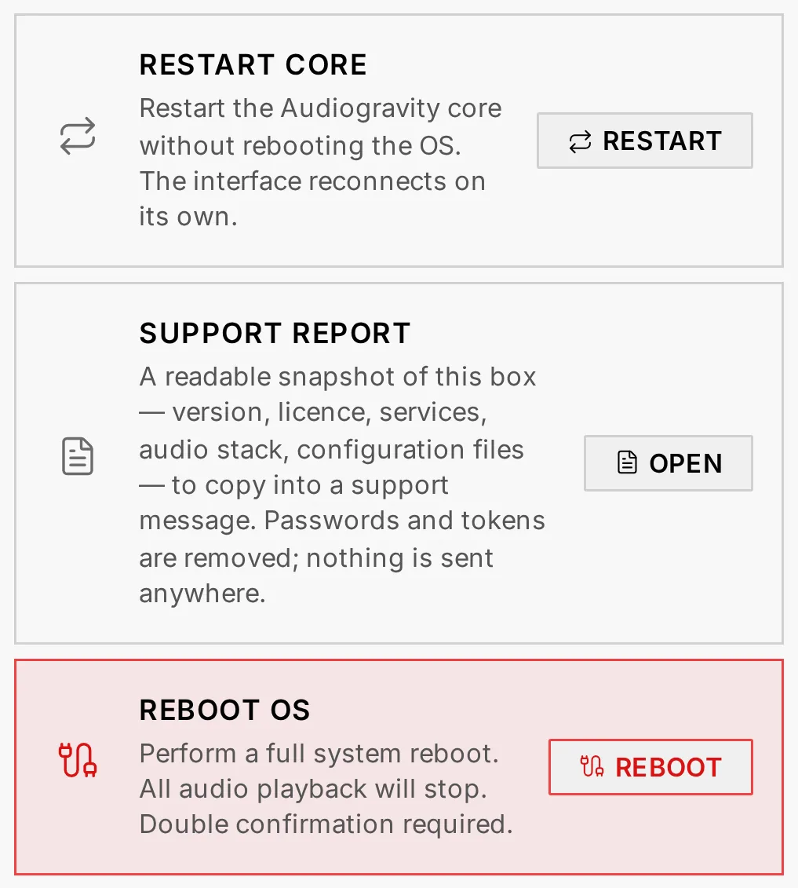

## Performance tuning (Pro)

Keep the processor at the right speed for glitch-free playback, and measure how well
the box — and your network — keep up.

Each core has its card: its **frequency**, its **temperature** — green, amber above
50 °C, red above 70 °C — and its **load**, one bar per measurement on the same 0–100 %
scale for every core, so the cores compare at a glance. The time the bars cover is
written next to *Load*.

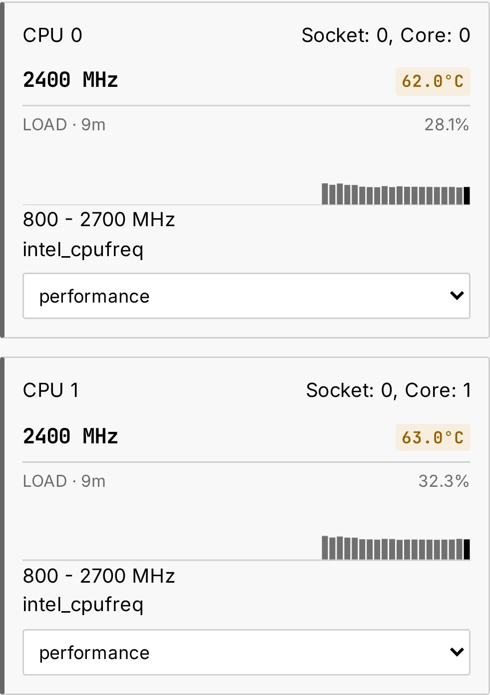

- **CPU governor** — how the processor adjusts its speed. The choices are those your
  processor offers, typically *performance* (full speed at all times, the steadiest for
  audio), *schedutil* (follows the load) and *powersave* (not recommended for audio).
  Set it per core with the menu at the bottom of its card, or with *Apply All*, under
  the cards, for every core — its confirmation names the governor it will set. *Save Conf* keeps the current choice, and *Create
  Service* puts the saved choice back at every start-up: save first, or there is
  nothing to put back.
- **THROTTLED badge** — appears on a core the processor had to slow down since the
  previous measurement: because it ran too hot, on processors that report it (Intel's),
  or, on a Raspberry Pi, because its power supply could not keep up — the whole
  processor slows then, and every core shows the badge. Sustained throttling during
  playback causes glitches.
- **RT process monitor** — shows whether the audio programs run in real time: MPD,
  AirPlay, and Roon Bridge with its RAAT server. A green badge (SCHED_FIFO / SCHED_RR)
  means real time; a red **NON-RT** badge means the program can be held up while the box
  is busy — give it a real-time policy in [Systemd tuning](#systemd-tuning-pro).

### Latency test

Measures how quickly the box answers a timer: the worst delay it finds is what an audio
program risks when the box is busy. Set the test, click **TEST**, and read the result.

- **Threads** (1–16) — how many measurements run side by side: 1 for a quick look, one
  per processor core to load the whole box.
- **Priority (RT)** (1–99) — the real-time priority the test runs at; 99 by default.
- **Loops** (at least 1 000) — how many measurements each thread takes. The test lasts
  loops × interval: the default 10 000 loops take one second, 1 000 000 under two
  minutes — a longer run catches rarer delays.
- **EXPERT** shows the finer settings: the **Interval** between measurements (100 µs by
  default), the range of the histogram, the **CPU Affinity** — the cores the test runs
  on, such as `2,3`; left empty, any of them — and two switches best left on, **Memory
  Lock** and **Quiet Mode**.

In the result, **Max** is the figure that matters: the worst delay seen, in
microseconds. The histogram shows how often each delay occurred.

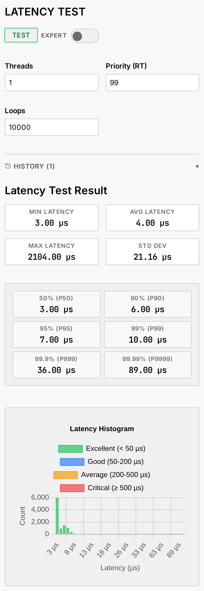

### Network test

Checks that your network carries audio without hiccups — worth running when streaming,
Roon, AirPlay or a NAS stalls. Choose a mode, set it, and click **TEST**.

- **PING (Quick Check)** — sends 20 small packets to a host (1.1.1.1 by default; your
  router's address tests your home network alone) and reports the delay, how much it
  varies (*jitter*) and any packet lost.
- **IPERF3 UDP (Audio Streaming)** and **IPERF3 TCP (Throughput)** — a test server
  sends a steady stream to the box for the chosen **Duration**, at the chosen
  **Bandwidth**. The server runs on another machine of your network: install iperf3
  there, start it with `iperf3 -s`, and enter its address in **Server**. Set
  **Bandwidth** to what your music needs — DSD512 and PCM 768 kHz take close to
  50 Mbit/s (`50M`). UDP reports jitter and loss at that rate; TCP reports whether the
  rate holds, and how many packets had to be sent again.
- **Internal Server Service** — **START SERVICE** runs a test server on the box itself,
  so that another machine can test its way to the box.

The verdict — **EXCELLENT**, **GOOD**, **FAIR** or **CRITICAL** — sums up the jitter, the
loss and, for iperf3, the bandwidth reached.

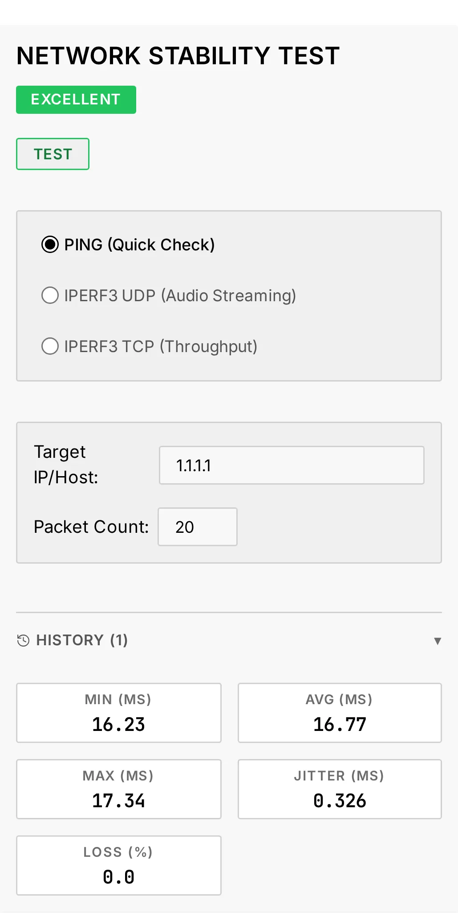

Each test keeps a **History** of the last ten tests run from this browser, latency and
network together; **Clear** empties both.

## Systemd tuning (Pro)

Low-level, per-service OS tuning using systemd **drop-in overrides** — the native
`.service` files are **never modified**; everything lives in an isolated
`.d/override.conf`.

- **CPU affinity** — pin a service to specific cores to cut context-switching jitter.
- **RT scheduling** — FIFO/RR policy and priority (1–99) for guaranteed CPU time.
- **CPU weight / I/O priority / OOM score** — bias the scheduler, disk access and the
  out-of-memory killer in favour of audio.
- **RT preset** — *Audio Optimized* pre-fills a battle-tested config (SCHED_FIFO 80,
  LimitRTPRIO 99, MEMLOCK infinity, I/O realtime, OOMScoreAdjust −500, CPUWeight 1000).
- **Safety** — a diff preview before applying; *Restore Backup* puts the previous
  settings back, and *Remove Override* returns the service to its original settings. A
  running service is restarted on them at once; if it does not start with them, it gets
  back the settings it was running on, and you are told. A stopped service stays
  stopped.
- **Settings a service cannot start with are refused** before anything is saved, with
  the reason: a real-time priority without a real-time policy or the reverse, a CPU the
  box does not have, a memory limit under 16 MB, an open-file limit under 1024.
- **A change that stops a service is undone.** A running service is restarted on its
  new settings and watched for a few seconds; if it does not stay up, the previous
  settings are put back, the service is started again, and you are told. A service that
  is not running is not started by a save: its new settings apply at its next start.

## Announcements

From time to time Audiogravi<sup>ty</sup> broadcasts a short announcement — release
news, an important notice. Unread announcements appear as **dismissible banners** at
the top of the **Admin** page, and the Admin tab carries a small marker until you have
seen them (the same cue it uses for a [waiting update](08-updating.md)). Dismissals
are remembered per device.

## Licence

The licence panel opens from the **Admin** tab (and automatically when a **Starter**
install taps a Pro tab — those carry a small lock icon in the tab bar).

- **Trial** — 30 days of full access, auto-activated on first run.
- **Buying** — the licence panel lists the steps: *Pay with PayPal*, receive your
  licence key by email, then **LICENSE KEY**, enter the key, **CHECK KEY** and
  **ACTIVATE THIS MACHINE**. No restart is needed.
- **Lifetime** — a `.lic` file for this one installation, identified by its
  **Device ID**. One-time payment, no subscription, no end date; it covers every 1.x
  version, and the 0.9 beta before it (see
  [11. FAQ → Are updates included?](11-faq.md#are-updates-included)).
- **Time-limited** — the same file, issued to run until a given date. The panel shows
  that date while the licence is valid, and the plan reads *Time-limited* rather than
  *Perpetual*. Every Pro feature is unlocked exactly as with a lifetime licence.
- **Import / re-download** — import a `.lic` file, or re-download yours from the
  self-service portal (purchase email + Device ID, no account needed) if it has gone
  missing from this installation.
- **Reinstalled the system, moved to another machine, or replaced its network card?**
  The box then has a new **Device ID**, and your licence no longer matches it — neither the portal nor your old
  file can fix that. Write to [support@audiogravity.app](mailto:support@audiogravity.app)
  with your **Order ID** and the new **Device ID**: a licence reset is available on
  request (see
  [9. Troubleshooting](09-troubleshooting.md#licence-not-recognised-after-a-reinstall-or-a-new-machine)).

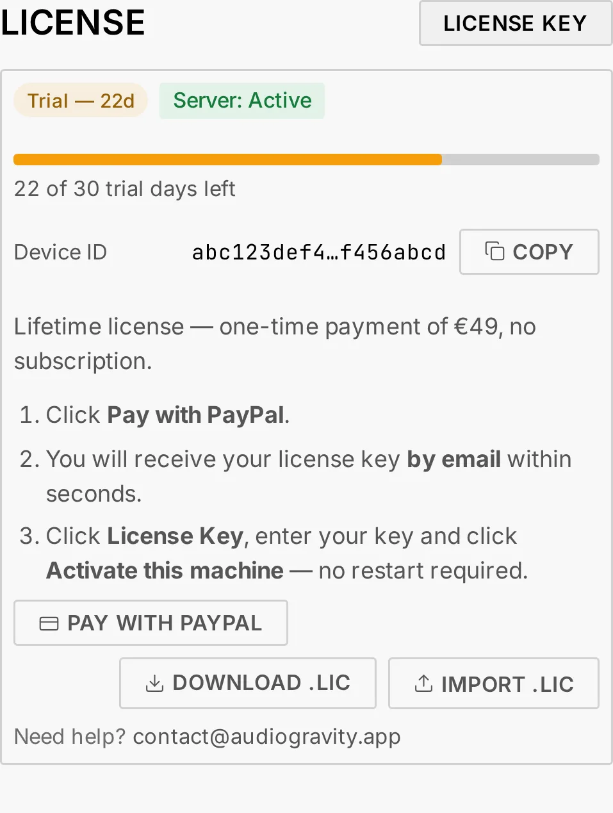

Once the licence is activated the same panel changes shape: the countdown gives way to
the plan, the order the key came from, and the date it was activated.

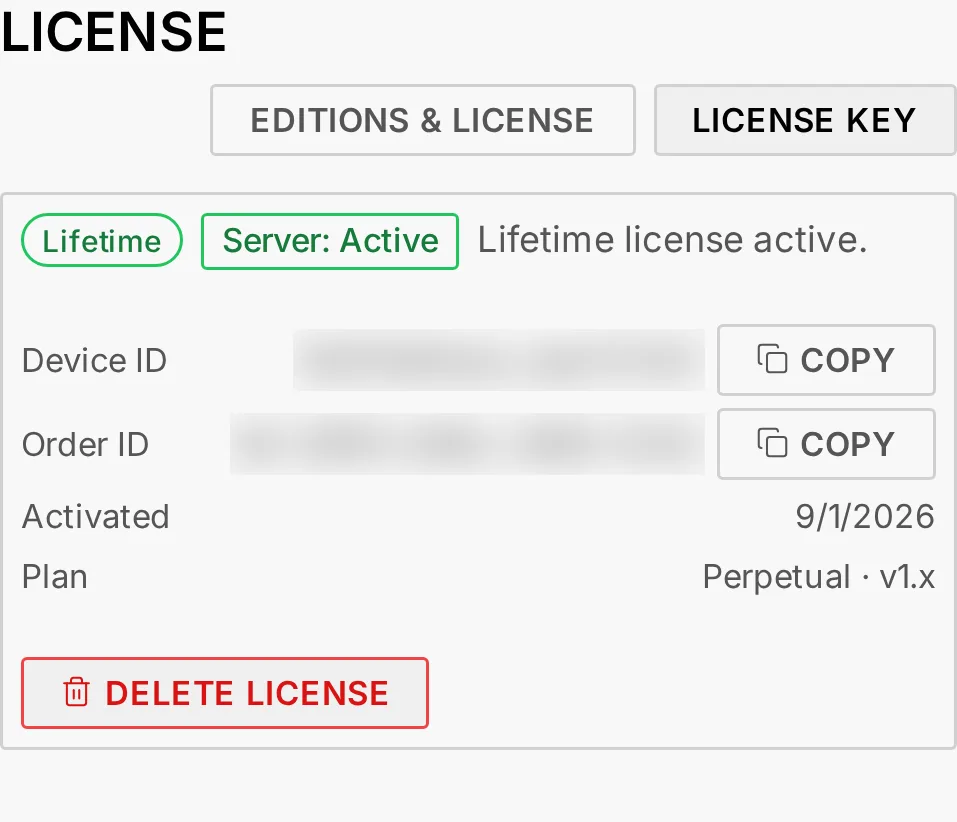

### What the box sends to the licence server

Whether Pro is unlocked is decided **on the box**, from the signature of its `.lic` file —
no network round-trip gates it. Alongside that, the box checks in with the licence
server once a day; that channel is how revocations,
[announcements](#announcements) and [update offers](08-updating.md) reach you.

The check-in carries what the licence needs and nothing more: the **Device ID**, the
primary **MAC address**, the operating system and architecture, the
Audiogravi<sup>ty</sup> version, the current licence status and — during the trial —
its start date. The `.lic` file itself travels when it is verified, and the **hostname**
you type when activating a key. The server records the network address the request
arrives from. Your music, your library paths, your service credentials and what you
listen to never leave the box.

A Pro licence is tied to one machine, so this exchange is part of how the licence works
and is not optional.

## Related

- [8. Updating](08-updating.md) — keeping the box current
- [9. Troubleshooting](09-troubleshooting.md) — when something misbehaves
