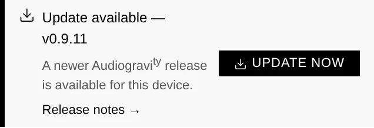

# 8. Updating

Audiogravi<sup>ty</sup> updates itself from the browser — no terminal, no re-running scripts.

## One-click self-update

When a newer release is available, the **Admin** page shows an update banner with the
new version, a release-notes link, and a **required** badge if the update is critical.
You don't need the page open to notice: the **Admin tab** itself carries a small
download marker whenever an update is waiting — in the warning colour when it is
**required**.



Installing it is one action:

1. A short confirmation (playback briefly stops) and your **admin password**.
2. The box **downloads** the new version, **swaps** the binary, and **health-checks**
   that it comes back up on the **right version**.
3. Live progress the whole way — *downloading → installing → verifying* — even across
   the service restart.

On an **all-in-one** box, the same click updates the **core and the interface
together**, so everything lands on the new version at once.

### Safety: automatic rollback

If anything goes wrong, the box **automatically rolls back** to the previous version
and tells you — you're never left on a broken update. The updater runs detached from
the app, so it survives the restart it triggers. There's **no OS reboot**; only a
brief pause while the audio service restarts.

## Split installs (different hosts)

One-click self-update covers a **co-located** core + ui. If your core and interface
run on **different hosts**, update each side separately (see below) — the one-click
action updates the box it runs on.

## Manual update

You can always update by re-running the installer; your configuration is preserved —
both `.env` and the editable files under `/etc/audiogravity` (the audio setup, the
signal-chain map, and your saved radio stations). A **fresh** install seeds those files
with sensible defaults; an **upgrade never overwrites them**, so your edits survive:

```bash
curl -fsSL https://audiogravity.app/install.sh | sudo bash -s -- --token ghp_xxx
```

## Version-mismatch banner

If the interface and the core end up on different versions (for example after a
partial or multi-host update), a banner appears in the Admin tab prompting you to
update the other component. It's silent when the two match.

## Backup & restore

Everything that makes your box *yours* lives in a handful of files. Copy them before
an OS reinstall (or on a schedule) and you can rebuild the box in minutes:

| What | Where |
|------|-------|
| Audio setup — services & profiles registry, hi-fi chain map, saved radio stations | `/etc/audiogravity/` (`audio-config.json`, `audio-topology.json`, `radio.json`) |
| Your **licence** and its public key | `/etc/audiogravity/audiogravity.lic`, `license.pub` |
| **Accounts** — users, roles, password hashes, passkeys | `/opt/audiogravity/core/users.json` |
| Core **runtime config** — API key, security secrets, enabled modules | `/opt/audiogravity/core/.env` |

The simplest habit — grab everything in one archive:

```bash
sudo tar -czf ag-backup-$(hostname)-$(date +%F).tar.gz \
    /etc/audiogravity \
    /var/backups/audiogravity \
    /opt/audiogravity/core/users.json \
    /opt/audiogravity/core/.env
```

**Restore** on a fresh install: run the installer first
(see [2. Installation](02-installation.md)), then unpack the archive over the new
files (`sudo tar -xzf ag-backup-….tar.gz -C /`) and restart the core
(`sudo systemctl restart ag-core-server`). Service config files regenerate through
the guided setup, and streaming-service logins are simply re-entered in
**Library → Sources**. Your music itself lives on the NAS/USB drive — it is never
stored on the box.

> Editor-level backups (the timestamped copies the Config editor keeps before every
> save) live under `/var/backups/audiogravity` — that's why the archive above
> includes it.
