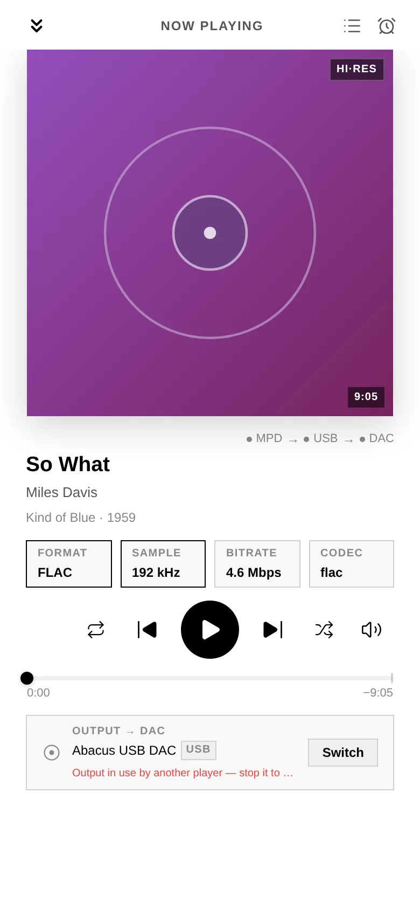
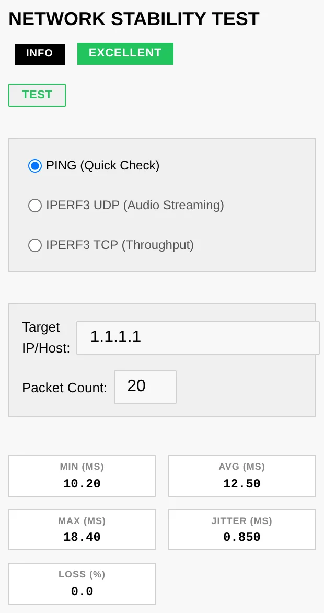

# 9. Troubleshooting

Most issues come down to a service that isn't running, an output that points at the
wrong device, or a network hop that's flaky. Audiogravi<sup>ty</sup> surfaces all three in the
interface.

## No sound / wrong output

**Read the message first.** Audiogravi<sup>ty</sup> now tells you why a track will not play,
as a notification and under the output in the fullscreen player. Start there — the
answer is usually on screen:



- *"Output in use by another player"* — your sound card is **exclusive** (that is what
  makes bit-perfect playback possible), so only one player can hold it at a time.
  Stop the other one — often HQPlayer: turn its **Use as output** switch off and the
  card is released (see [6. Outputs & engines](06-outputs-engines.md)).
- *"its network audio daemon (NAA) is not running"* — HQPlayer is your output but the
  piece that feeds your DAC is stopped. Start it in **Services**, or turn the switch
  off to play locally.
- *"cannot be decoded"* — the track's format is not one HQPlayer handles (AAC, ALAC,
  OGG, WMA). Turn the switch off to play it on the local output.
- *"Both HQPlayer and a network renderer are selected"* — pick one.

If nothing is displayed:

- Check the **output selector** — is the right destination (Local DAC vs a network
  renderer) selected?
- In **Config**, confirm the service's **audio output** badge points at your DAC. If
  the card index drifted after a hardware change, re-run **Guided → output** (the DAC
  index is normally pinned automatically — see [3. First run](03-first-run.md)).
- In **Services**, confirm the relevant service (mpd, shairport-sync…) is **RUNNING**.

## A service won't start

- Open **Services** → click the service name for its detail modal (live metrics + the
  session action history), then **restart** it.
- If a **Systemd** tuning override made it unstable, use **Restore Backup** or **Remove
  Override** on the Systemd tab to roll it back to factory behaviour instantly.
- For deeper output, use the browser **Terminal** (System tab, admin) — e.g.
  `systemctl status mpd` / `journalctl -u mpd -e`.

## Streaming fails or a track won't play

- Confirm the service is **Connected** in Library → Sources, and that your
  **subscription** covers Hi-Res (see [5. Library & streaming](05-library-streaming.md)).
- A track that played before but fails later is usually an **expired streaming link** —
  Audiogravi<sup>ty</sup> refreshes these automatically; retry the track.
- **HIGHRESAUDIO** allows a single active device — if it signed out, reconnect.
- **With HQPlayer as your output**, streaming services and AAC radio stations are
  refused on purpose — Audiogravi<sup>ty</sup> names the reason. Turn **Use as output** off to
  play them locally (see [6. Outputs & engines](06-outputs-engines.md)).

## Casting to a renderer stalls

- Check the renderer is reachable on the LAN and appears in the output selector.
- Network renderers depend on your local network — run the **Network Test**
  (Performance tab) to check jitter/loss.



## A UPnP renderer or media server isn't discovered

UPnP discovery rides on **multicast** (SSDP). If a device you know is on doesn't
show up after a **manual scan**:

- Make sure the box and the device are on the **same subnet / VLAN** — multicast
  rarely crosses network segments.
- On managed switches or mesh Wi-Fi, look for **IGMP snooping** settings — snooping
  without an IGMP querier silently eats multicast; either enable the querier or
  disable snooping for that LAN.
- Some Wi-Fi access points ship with **multicast filtering / "IGMP proxy"** enabled —
  try the device on Ethernet to isolate the cause.

## The box doesn't appear as an AirPlay speaker

AirPlay is announced over **mDNS/Bonjour** (UDP 5353 multicast):

- Confirm the **shairport-sync** service is RUNNING (Services tab).
- The sender (iPhone/Mac) must be on the **same subnet** — mDNS does not cross
  VLANs without an mDNS repeater on the router.
- The same **multicast filtering** culprits as above (IGMP snooping, AP isolation,
  "client/guest isolation" on the Wi-Fi network) also hide AirPlay devices.

## Audio glitches / dropouts

- Watch for a **THROTTLED** badge on a CPU core (Performance tab) — sustained thermal
  throttling causes glitches; improve cooling or ease the CPU governor.
- In the **RT process monitor**, audio processes should show **SCHED_FIFO / SCHED_RR**
  (green), not NON-RT (red). Apply the *Audio Optimized* preset on the Systemd tab.
- Run the **Latency test** (`cyclictest`) — a high max latency points at scheduling
  contention.

## Manual NAS mount (terminal)

The library picker's **Add network share** covers CIFS/SMB. If you prefer the
terminal, or need **NFS**, mount at the OS level — anything mounted under
`/mnt` is detected as a library source:

```bash
# 1. Create a mount point
sudo mkdir -p /mnt/music

# 2a. CIFS / SMB — the quoted heredoc keeps special characters
#     in the password intact
sudo tee /root/.smbcredentials >/dev/null <<'EOF'
username=nasuser
password=naspass
EOF
sudo chmod 600 /root/.smbcredentials
echo "//192.168.1.20/music /mnt/music cifs credentials=/root/.smbcredentials,ro,_netdev 0 0" \
    | sudo tee -a /etc/fstab

# 2b. — or NFS (requires: sudo apt-get install nfs-common)
echo "192.168.1.20:/volume1/music /mnt/music nfs ro,_netdev 0 0" | sudo tee -a /etc/fstab

# 3. Mount and verify
sudo systemctl daemon-reload && sudo mount -a && ls /mnt/music
```

`_netdev` makes the mount wait for the network at boot, and `ro` (read-only) is
a sensible default for a music library. The SMB version is best left
unpinned — the kernel negotiates the highest dialect both ends support (SMB 2.1
to 3.1.1). As a **last resort** for legacy NAS firmware you can add `vers=2.0`;
avoid `vers=1.0` (SMB1) unless you have no other option — it is deprecated and
insecure, and modern kernels disable it by default. Back in the picker, hit
refresh — the share appears as a library choice.

## Locked out — no admin can log in

Accounts live in `/opt/audiogravity/core/users.json` on the box. If the admin
password is lost, connect over SSH, remove that file, and re-run the installer
(see [8. Updating → Manual update](08-updating.md#manual-update)): when no user file exists, the
install seeds the default **`admin` / `admin123`** account again. This resets **all**
accounts and their passkeys — your audio configuration is untouched. Sign in, set a
fresh password immediately, and re-create the other accounts.

## Passkeys or push notifications unavailable

Passkeys (WebAuthn) and Web Push need Audiogravi<sup>ty</sup> reachable over a real HTTPS
**domain** — they do **not** work over a bare IP, and `--public-url` alone is not
enough: you also need the domain, a valid certificate and a reverse proxy. The full
recipe is in
[2. Installation → Getting HTTPS](02-installation.md#getting-https--for-passkeys-and-push).

## Version-mismatch banner

The interface and core are on different versions — update the other component. See
[8. Updating](08-updating.md).

## "Update failed to start — An update is already in progress"

A previous update was interrupted (power loss, reboot, or a crash mid-install) and
left a stale "in progress" marker, so the core refuses to start a new one.

- **No action needed in most cases** — the core treats a stuck update as dead after
  **15 minutes** and frees the lock automatically. Wait, then retry from the update
  banner.
- **To unblock immediately**, an admin can clear the marker from the Terminal and retry:
  ```bash
  sudo rm -f /etc/audiogravity/self-update.state
  ```
  This only resets the *status* flag; it does not touch the installed version. Check
  the current versions afterwards (App title / login screen) — if the core moved but
  the interface did not, re-run the interface installer (see [8. Updating](08-updating.md)).

## Getting help

- **Bug reports & questions** — [open an issue](https://github.com/audiogravity/audiogravity.site/issues).
- **Logs** — the System event log (in-app) and `journalctl -u ag-core-server` /
  `journalctl -u <service>` from the Terminal.
- More answers on the [website FAQ](https://audiogravity.app/#faq).
