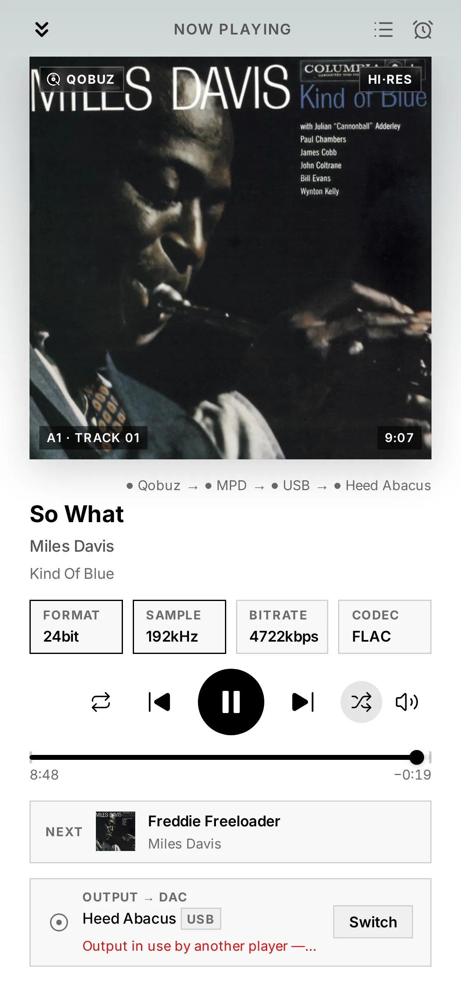
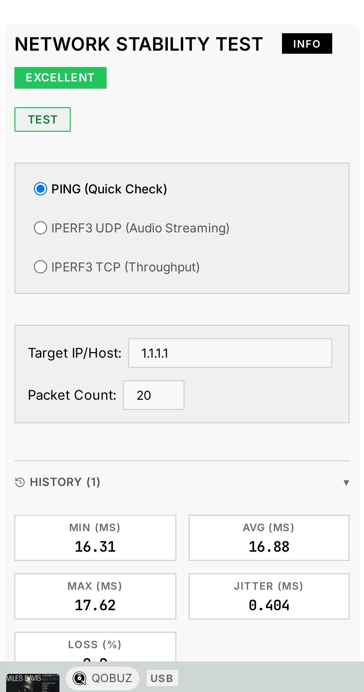

# 9. Troubleshooting

Most issues come down to a service that isn't running, an output that points at the
wrong device, or a network hop that's flaky. Audiogravi<sup>ty</sup> surfaces all three in the
interface.

**Before you write in**, open **System › Actions › Support Report**. It gathers the state
of the whole box in one gesture — versions, services, outputs, configuration files,
library — with passwords and tokens removed, and gives you a **Copy** button. Pasting it
into your message saves the round-trips that would otherwise be spent asking you what
your box looks like. See [7. Administration](07-administration.md#support-report).

## No sound / wrong output

**Read the message first.** Audiogravi<sup>ty</sup> now tells you why a track will not play,
as a notification and under the output in the fullscreen player. Start there — the
answer is usually on screen:

- *"Output in use by another player"* — your sound card is **exclusive** (that is what
  makes bit-perfect playback possible), so only one player can hold it at a time.
  Stop the other one — often HQPlayer: turn its **Use as output** switch off and the
  card is released (see [6. Outputs & engines](06-outputs-engines.md)).
- *"its network audio daemon (NAA) is not running"* — HQPlayer is your output but the
  piece that feeds your DAC is stopped. Start it in **Services**, or turn the switch
  off to play locally.
- *"which HQPlayer cannot decode"* — the track's format is not one HQPlayer handles;
  the message names it. (The full list is in
  [6. Outputs & engines](06-outputs-engines.md#what-can-and-cannot-go-through-hqplayer).)
  Turn the switch off to play it on the local output. A whole album is refused if
  **any** of its tracks is in such a format — the message names that track — so you get
  one clear answer instead of music stopping partway through.
- *"Both HQPlayer and a network renderer are selected"* — pick one.
- *"The speaker you selected is not answering"* — the renderer is asleep, off the
  network, or still reconnecting. Wake it up, or pick another output. Audiogravi<sup>ty</sup>
  refuses rather than playing out of the local DAC behind your back.
- *"says it is playing but its position is not moving"* — HQPlayer accepted the track
  and reports playing, but nothing is coming out: the sound card is held elsewhere.
  Same fix as the first entry.
- *"accepted the track but never started playing it"* — either the sound card is busy,
  or HQPlayer cannot decode that format.

> **A message can arrive a few seconds after you press play.** Whether sound really
> came out of HQPlayer cannot be known instantly — a heavy chain takes time to start.
> Playback begins immediately and the check runs behind it, so a problem shows up
> under the output shortly after, not at the moment of the tap. It clears on its own
> as soon as the music plays.



If nothing is displayed:

- Check the **output selector** — is the right destination (Local DAC vs a network
  renderer) selected?
- In **Config**, confirm the service's **audio output** badge points at your DAC. If
  the card index drifted after a hardware change, re-run **Guided → output** (the DAC
  index is normally pinned automatically — see [3. First run](03-first-run.md)).
- In **Services**, confirm the relevant service (mpd, shairport-sync…) is **RUNNING**.

## My DAC is not in the output list (Raspberry Pi HAT)

A **HAT** — a DAC board stacked on the Pi's GPIO header (HiFiBerry, IQaudIO, Allo,
Pi-DAC…) — is not plug-and-play the way a USB DAC is. Linux creates a sound card for it
only once `/boot/firmware/config.txt` names its **device-tree overlay**. Until then the
board is invisible to the entire system, and no setting in Audiogravi<sup>ty</sup> can reveal
it: the output list mirrors the sound cards Linux exposes, nothing more. This is a
one-time manual step, and it is the same on every Pi-based music player.

> **Why is it not automatic?** The HAT standard lets a board carry a small memory chip
> describing itself, which the Pi's firmware reads at boot and acts on with no
> configuration at all. Many audio HATs ship that chip blank, so there is nothing to
> read — and the board's own chips sit on a bus that stays powered off until an overlay
> declares it. Nothing can be probed before the declaration exists.

**1. Confirm the board really is missing.** Over SSH, or in the browser **Terminal**
(System tab, admin):

```bash
cat /proc/asound/cards
```

If your DAC is not in that list, this section applies. If it *is* listed, the problem
lies elsewhere — go back to [No sound / wrong output](#no-sound--wrong-output).

**2. Find the overlay name for your board.** Every Raspberry Pi OS image ships the full
catalogue — around forty audio boards — and your kernel version, because some vendors
changed their overlay names at kernel **6.1.77**:

```bash
grep -iE "^Name:.*(hifiberry|iqaudio|allo|dac|digi|audio)" /boot/firmware/overlays/README
uname -r
```

Cross-check the name against your manufacturer's own documentation. HiFiBerry, for
instance, publishes one line per board and splits it by kernel version: a **DAC+ Pro /
DAC2 Pro** takes `hifiberry-dacplus` below 6.1.77 and `hifiberry-dacplus-pro` at or
above it — the wrong one still produces sound, but drives the clock from the Pi instead
of the board's own oscillators, which is precisely what you paid the Pro version for.

**3. Declare the board, then reboot.**

```bash
# Back the file up first — a broken boot file leaves the box unreachable
sudo cp /boot/firmware/config.txt /boot/firmware/config.txt.bak-$(date +%F)
sudo nano /boot/firmware/config.txt
```

Make three changes at the **top** of the file, before the first `[…]` line — settings
placed after one apply only to that model of Pi:

| Change | Line | Effect |
|---|---|---|
| Required | `dtoverlay=hifiberry-dacplus-pro` *(your board's line)* | Declares the DAC |
| Recommended | `dtparam=audio=on` → `dtparam=audio=off` | Turns the Pi's own headphone jack off |
| Optional | `dtoverlay=vc4-kms-v3d` → `dtoverlay=vc4-kms-v3d,noaudio` | Turns HDMI audio off |

The last two are not cosmetic: with the jack and both HDMI outputs still active, your
DAC is one candidate among four and Audiogravi<sup>ty</sup> will not presume which one you
meant. Silence them and it selects your DAC on its own. Skip them only if you actually
use the jack or HDMI sound.

Then reboot:

```bash
sudo reboot
```

**4. Verify, then point Audiogravi<sup>ty</sup> at it.**

```bash
aplay -l
```

Your DAC should now be listed — under its real name, `HiFiBerry DAC+ Pro` and the like,
not a generic label. Back in the interface, run **Guided → output** (see
[3. First run](03-first-run.md)) and pick it: that is the step that writes the output
into each service's configuration. Detection alone routes nothing.

> **If nothing appears after the reboot**, the board is declared but not answering.
> Check that it is fully seated on the header, and — a documented quirk on some
> installs — try adding `force_eeprom_read=0` to the same file.
>
> **If the box does not come back on the network**, the boot file is at fault. Power it
> off, read the SD card on another computer, and rename your `config.txt.bak-…` back to
> `config.txt`. This is why step 3 starts with a backup.

> **On an older image**, this file lives at `/boot/config.txt` instead. Recent Raspberry
> Pi OS releases leave a stub there pointing to the new location — if you open it and it
> says the file has moved, follow it.

## The signal path is empty

The Pipeline tab shows what is playing, and then nothing underneath — no box, no
converter, no speakers.

The view draws a device only when audio actually flows through one of the connections
**you have described**, and a new box carries an example chain: a converter reached over
USB and optical. Two common cases leave that example unmatched, and the panel names which
one you are in:

- **It names an output it found** — “this box is playing through *HiFiBerry DAC+ Pro*,
  which your described chain does not mention”. Your hardware is fine and the music plays;
  the description is simply not yours yet. A **HAT board** mounted on a Raspberry Pi's
  connector is the usual case, since the example declares USB and optical. Describe your
  own chain in **Pipeline → CONFIG** on a computer and the path appears.
- **It says nothing is flowing** — the description matches your gear, but no music is on
  its way through it. Start playing, and the path lights up.

**CONFIG** sits at the top of the Pipeline tab, on a phone as on a computer. The
description is a text file, so writing one from scratch is far easier at a keyboard — but
the phone can reach it, which matters when the box in front of you is showing nothing.

The description is yours to maintain: Audiogravi<sup>ty</sup> never rewrites it, precisely so
that it cannot undo the work of someone who has described their system carefully. See
[6. Outputs & engines → The signal path](06-outputs-engines.md#the-signal-path-and-the-chain-you-describe).

## A service won't start

- Open **Services** → click the service name for its detail modal (live metrics + the
  session action history), then **restart** it.
- If a **Systemd** tuning override made it unstable, use **Restore Backup** or **Remove
  Override** on the Systemd tab to roll it back to factory behaviour instantly.
- For deeper output, use the browser **Terminal** (System tab, admin) — e.g.
  `systemctl status mpd` / `journalctl -u mpd -e`.

## Disk or network stays empty for a service

Its **DISK** or **NET** figure shows a dash and draws no graph, while CPU moves.

Those two are counted per service, and the counting is off until you ask for it. Open the
**Systemd** tab, pick the service, and enable **IO Accounting** and **IP Accounting** in
its override editor. The figures appear within seconds — no reboot, and no effect on
playback.

A dash is not a zero: a service that genuinely reads nothing from disk shows `0`, not a
dash.

## Memory reads 0 for every service

In **Services**, every card shows *0 MB* and its little memory graph stays flat, while the
CPU figures next to them move normally.

Nothing is wrong with the services: your box's **kernel was started with memory accounting
switched off**, so there is no figure for anyone to read. It is the factory setting of
Raspberry Pi OS, which saves a few megabytes of kernel memory by not counting. systemd
itself reports nothing for those services, and Audiogravi<sup>ty</sup> can only show what
the system measures. CPU keeps working because that counter is enabled and the memory one
is not.

**Confirm it in two commands**, over SSH or in the browser **Terminal** (System tab, admin):

```bash
cat /sys/fs/cgroup/cgroup.controllers   # 'memory' missing from the list
cat /proc/cmdline                       # contains cgroup_disable=memory
```

**Turn the counter on.** Edit the boot command line and restart:

```bash
# Back the file up first — a broken boot file leaves the box unreachable
sudo cp /boot/firmware/cmdline.txt /boot/firmware/cmdline.txt.bak-$(date +%F)
sudo nano /boot/firmware/cmdline.txt
```

Remove `cgroup_disable=memory`. If your file has no such setting but memory is still
missing from the controller list, add `cgroup_enable=memory cgroup_memory=1` instead.
Then `sudo reboot`, and the figures appear on their own.

> **This file is a single line.** Every setting sits on it, separated by spaces — an
> editor that adds a line break makes the box fail to boot. Change only the words you came
> for, save, and check the file still holds one line (`wc -l` answers 0 or 1).
>
> **If the box does not come back**, power it off, read the SD card on another computer,
> and rename your `cmdline.txt.bak-…` back to `cmdline.txt`. This is why the first command
> above is a backup.

> **On an older image** this file lives at `/boot/cmdline.txt` instead.

## An MPD app on my phone or computer can't reach the box

Audiogravi<sup>ty</sup> keeps MPD reachable **from the box only** — the interface, the
UPnP renderer your phone casts to, and playback itself all talk to it from inside the
machine, so nothing you do through Audiogravi<sup>ty</sup> is affected. A third-party
MPD application connecting straight to the box is what stops working.

This is deliberate. MPD's control port asks for no password: open to the network, it
lets anything on your network start, stop and browse your music. On some boxes it was
open by accident of the Debian packaging, and closing it is also what makes a service
you stopped stay stopped — the same open port is what used to bring MPD back to life
seconds after you switched it off.

Control the box from the Audiogravi<sup>ty</sup> interface, or cast to it as a UPnP
renderer, which stays open on the network as before. If a third-party MPD app is part
of how you listen, say so through [Getting help](#getting-help) — reopening that port
is reasonable, but it should be a switch you turn on knowingly rather than a default.

## Streaming fails or a track won't play

- Confirm the service is **Connected** in Library → Sources, and that your
  **subscription** covers Hi-Res (see [5. Library & streaming](05-library-streaming.md)).
- A track that played before but fails later is usually an **expired streaming link** —
  Audiogravi<sup>ty</sup> refreshes these automatically; retry the track.
- **HIGHRESAUDIO** allows a single active device — if it signed out, reconnect.
- **Tidal in silence, on any output.** Tidal's lossy qualities (HIGH, LOW) deliver AAC,
  which cannot be converted losslessly — nothing plays, anywhere. Set Tidal to a lossless
  quality. The same message appears when the **album itself** is not available in lossless
  even though your setting is right: Audiogravi<sup>ty</sup> checks what Tidal actually
  serves before it starts, and names the cause instead of leaving you with silence.
- **With HQPlayer as your output**, a track in a format HQPlayer cannot decode is refused
  wherever it comes from — your library, a media server or a radio station — and the
  message names the format and the track. Turn **Use as output** off to play it on the
  local output. Which *source* it comes from no longer matters: every source reaches
  HQPlayer, streaming services included — the formats it accepts, and those it does not,
  are listed in
  [6. Outputs & engines](06-outputs-engines.md#what-can-and-cannot-go-through-hqplayer).

## The browser warns about the certificate, or the app won't install

On a self-signed setup the box signs its own certificate, so no browser knows it
until you say so.

- **On an iPhone or iPad, the address does not open at all** — Safari offers no way past
  the warning, so there is nothing to accept and no way in until the box's authority is
  trusted. This is the one case where the step is not optional:
  [3. First run → Trust the box's certificate](03-first-run.md#7-trust-the-boxs-certificate-once-per-device).
- **A warning on every visit (Android, computer)** — accept it to look around; to stop
  the warnings and unlock the app install, trust the box's authority once per device,
  same step.
- **Android's Chrome never offers "Install app"** — that prompt requires a trusted
  certificate. Same fix. There is nothing wrong with the site itself.
- **The home-screen icon opens on an error** — the app window has no way to show the
  "accept the risk" page a browser tab does, so an untrusted certificate simply fails
  there. Trust the authority, then reopen the app.
- **You upgraded, and the warning changed** — older boxes carried a certificate no
  modern browser accepts, whatever you did with it. Upgrading replaces it and creates
  the authority; trust that once and the app installs. Nothing to undo first, and any
  copy of the old certificate you had installed on a phone can simply be removed.
- **You put your own certificate on the box** — a valid one, whoever issued it, is
  detected and **left untouched**: no authority is created, nothing is published, and
  renewal stays with whatever issues it. The box only steps in if that certificate has
  actually expired, or carries no `subjectAltName` (which no browser accepts).
- **You changed the box's address** — the certificate is reissued automatically for
  the new one, and the authority does not change, so devices that already trust it
  need nothing.

## A control snaps back, or an action says it failed

Audiogravi<sup>ty</sup> reads the player's answer before showing a command as done, so a
control that returns to its previous state is reporting a **refusal** — it is not a missed
tap, and repeating it will not help until the cause is fixed.

- **The volume slider glides back.** The output has no volume control of its own — common
  for a DAC used bit-perfect. Use the DAC's own control or its remote, or pick an output
  with a mixer (see [6. Outputs & engines](06-outputs-engines.md)).
- **Play/pause flips back, or next/previous does nothing.** The player refused or could
  not be reached; check it is running under Services, and see *No sound / wrong output*
  above.
- **Adding to the queue, or removing from it, reports an error.** The message carries the
  player's own reason. The usual ones: the track or album has left the library index since
  the page was drawn (**re-scan the library**), a radio station whose address the player
  rejects, or a queue row already removed from another device — reopen the queue to see
  its real content.
- **Queueing an album added only some of its tracks.** That is reported honestly rather
  than rolled back: the tracks that made it in are yours and are counted. Queue the rest
  again, and if it repeats, re-scan the library.

## The progress bar won't move

Jumping inside a track is declined — and says so — in three cases, none of them a fault:

- **Internet radio.** A live broadcast has no end to jump to.
- **The first seconds of a Tidal track's first listen.** The track plays while it is still
  arriving; the seekable copy is ready a few seconds in. Wait a moment and drag again — the
  rest of that first listen seeks normally.
- **A second jump while the first is still being applied.** Asking again immediately is
  declined rather than queued, so the track is not restarted several times over. Let the
  first one land.

## Casting to a renderer stalls

- Check the renderer is reachable on the LAN and appears in the output selector.
- Network renderers depend on your local network — run the **Network Test**
  (Performance tab) to check jitter/loss.



## A UPnP renderer or media server isn't discovered

UPnP discovery rides on **multicast** (SSDP). If a device you know is on doesn't
show up after a **manual scan**:

- Make sure the box and the device are on the **same subnet / VLAN** — multicast
  rarely crosses network segments.
- On managed switches or mesh Wi-Fi, look for **IGMP snooping** settings — snooping
  without an IGMP querier silently eats multicast; either enable the querier or
  disable snooping for that LAN.
- Some Wi-Fi access points ship with **multicast filtering / "IGMP proxy"** enabled —
  try the device on Ethernet to isolate the cause.

## The box doesn't appear as an AirPlay speaker

AirPlay is announced over **mDNS/Bonjour** (UDP 5353 multicast):

- Confirm the **shairport-sync** service is RUNNING (Services tab).
- The sender (iPhone/Mac) must be on the **same subnet** — mDNS does not cross
  VLANs without an mDNS repeater on the router.
- The same **multicast filtering** culprits as above (IGMP snooping, AP isolation,
  "client/guest isolation" on the Wi-Fi network) also hide AirPlay devices.

## Audio glitches / dropouts

- Watch for a **THROTTLED** badge on a CPU core (Performance tab) — sustained thermal
  throttling causes glitches; improve cooling or ease the CPU governor.
- In the **RT process monitor**, audio processes should show **SCHED_FIFO / SCHED_RR**
  (green), not NON-RT (red). Apply the *Audio Optimized* preset on the Systemd tab.
- Run the **Latency test** (`cyclictest`) — a high max latency points at scheduling
  contention.

## Manual NAS mount (terminal)

The library picker's **Add network share** covers CIFS/SMB. If you prefer the
terminal, or need **NFS**, mount at the OS level — anything mounted under
`/mnt` is detected as a library source:

```bash
# 1. Create a mount point
sudo mkdir -p /mnt/music

# 2a. CIFS / SMB — the quoted heredoc keeps special characters
#     in the password intact
sudo tee /root/.smbcredentials >/dev/null <<'EOF'
username=nasuser
password=naspass
EOF
sudo chmod 600 /root/.smbcredentials
echo "//192.168.1.20/music /mnt/music cifs credentials=/root/.smbcredentials,ro,_netdev 0 0" \
    | sudo tee -a /etc/fstab

# 2b. — or NFS (requires: sudo apt-get install nfs-common)
echo "192.168.1.20:/volume1/music /mnt/music nfs ro,_netdev 0 0" | sudo tee -a /etc/fstab

# 3. Mount and verify
sudo systemctl daemon-reload && sudo mount -a && ls /mnt/music
```

`_netdev` makes the mount wait for the network at boot, and `ro` (read-only) is
a sensible default for a music library. The SMB version is best left
unpinned — the kernel negotiates the highest dialect both ends support (SMB 2.1
to 3.1.1). As a **last resort** for legacy NAS firmware you can add `vers=2.0`;
avoid `vers=1.0` (SMB1) unless you have no other option — it is deprecated and
insecure, and modern kernels disable it by default. Back in the picker, hit
refresh — the share appears as a library choice.

## Locked out — no admin can log in

Accounts live in `/opt/audiogravity/core/users.json` on the box. If the admin
password is lost, connect over SSH, remove that file, and re-run the installer
(see [8. Updating → Manual update](08-updating.md#manual-update)): when no user file exists, the
install seeds the default **`admin` / `admin123`** account again. This resets **all**
accounts and their passkeys — your audio configuration is untouched. Sign in, set a
fresh password immediately, and re-create the other accounts.

## Passkeys or push notifications unavailable

Passkeys (WebAuthn) and Web Push need Audiogravi<sup>ty</sup> reachable over a real HTTPS
**domain** — they do **not** work over a bare IP, and `--public-url` alone is not
enough: you also need the domain, a valid certificate and a reverse proxy. The full
recipe is in
[2. Installation → Getting HTTPS](02-installation.md#getting-https--for-passkeys-and-push).

## Version-mismatch banner

The interface and core are on different versions — update the other component. See
[8. Updating](08-updating.md).

## "Update failed to start — An update is already in progress"

A previous update was interrupted (power loss, reboot, or a crash mid-install) and
left a stale "in progress" marker, so the core refuses to start a new one.

- **No action needed in most cases** — the core treats a stuck update as dead after
  **15 minutes** and frees the lock automatically. Wait, then retry from the update
  banner.
- **To unblock immediately**, an admin can clear the marker from the Terminal and retry:
  ```bash
  sudo rm -f /etc/audiogravity/self-update.state
  ```
  This only resets the *status* flag; it does not touch the installed version. Check
  the current versions afterwards (App title / login screen) — if the core moved but
  the interface did not, re-run the interface installer (see [8. Updating](08-updating.md)).

## The Config tab ignores the `appconfigfile` path I set

It is meant to. Audiogravi<sup>ty</sup> finds each service's configuration by itself,
wherever it lives — `/etc/mpd.conf` for a packaged MPD, `/usr/local/etc/shairport-sync.conf`
for a shairport-sync built from source. Nothing to set, and nothing that can point at
the wrong file.

An older box may still carry an `appconfigfile` line in
`/etc/audiogravity/audio-config.json`. It is simply ignored: leave it alone.

> If a service on your machine really does keep its configuration somewhere
> unexpected, there is currently no way to tell Audiogravi<sup>ty</sup> about it —
> [open an issue](https://github.com/audiogravity/audiogravity.site/issues) and
> describe your setup.

## "License ended on …" in the licence panel

Your licence was issued to run until a date, and that date has passed. Nothing is broken
and nothing was tampered with: Audiogravi<sup>ty</sup> keeps running in **Starter Edition**,
your music and settings are untouched, and the Pro features come back the moment a current
licence is installed.

The panel keeps your **Order ID** on screen — you need it to renew. Use **License portal**
to download a `.lic` for an order you have already paid for, or **Upload new license** if
you have the file already.

> A licence that has ended is not the same as *"License file is invalid or bound to a
> different device"*. That message means the file does not match this machine — most
> often after an OS reinstall, which changes the machine's fingerprint. Re-download
> your `.lic` from **License portal** with your purchase email and the **Device ID**
> shown in the licence panel.

## Getting help

- **Bug reports & questions** — [open an issue](https://github.com/audiogravity/audiogravity.site/issues).
- **Logs** — the System event log (in-app) and `journalctl -u ag-core-server` /
  `journalctl -u <service>` from the Terminal.
- More answers on the [website FAQ](https://audiogravity.app/#faq).
